# ASIS / TOBE Architecture

Status: draft  
Date: 2026-05-27  
Owner: Halunasu platform

## Decision Summary

Because there are no current customers, we can prioritize the future architecture over backward compatibility.

The target is a new monorepo and new GCP environment:

- New repository: `halunasu`
- New core GCP projects: `medical-core-stg` and `medical-core-497610`
- Shared Platform/Core data layer
- Product services remain separated by responsibility
- Firestore remains the primary operational store for the initial phase
- Cloud Storage holds large clinical artifacts
- LP never writes directly to the database

The most important boundary is:

- Shared: organization, facility, department, member, auth, billing, patient index
- Product-owned: charting encounters, audio, transcripts, SOAP, fee calculation sessions, extracted facts, receipt artifacts, referral drafts and PDFs

## ASIS: Repository And Runtime Shape

The current system is split across three repositories. `medical` already owns most platform-like concerns, while `medical-fee-calculation` has a separate tenant/auth/runtime path.

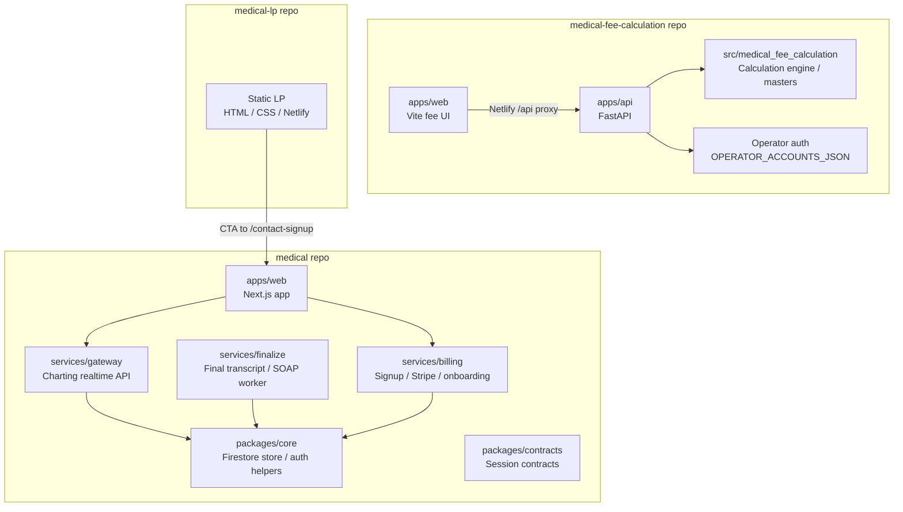

## ASIS: GCP And Hosting

The current staging/runtime topology is split by product history.

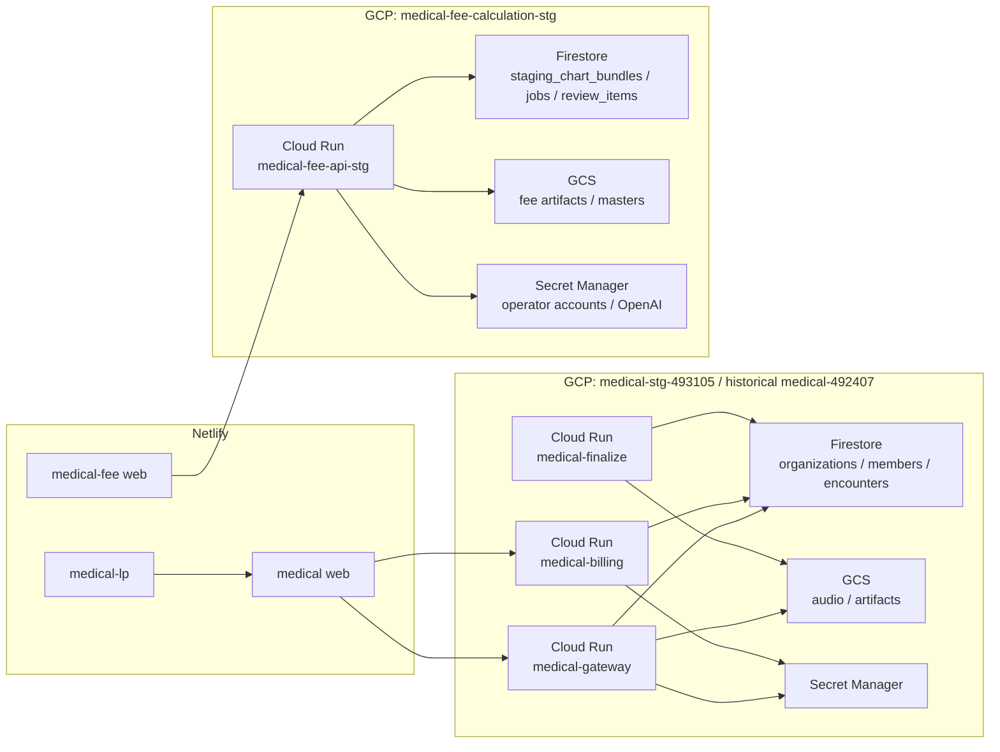

## ASIS: Data Ownership Problems

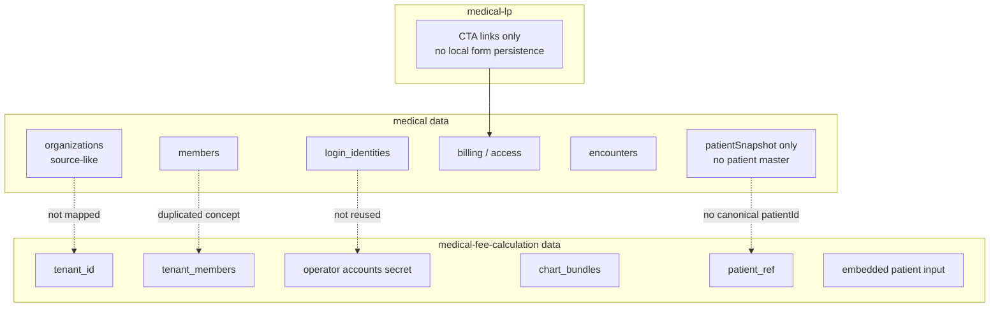

Current issues:

- Organization and tenant identity are not unified.
- Auth/session implementation is duplicated by product.
- Patient master does not exist.
- Fee calculation stores `patient_ref` and optional embedded patient input, but not a shared `patientId`.
- LP routes signup into `medical`, so signup is already centralized in behavior but not cleanly named as Platform.
- Future referral letter creation would need patient, facility, department, doctor, and document data. Adding it to the ASIS shape would create another partial platform.

## TOBE: Monorepo Shape

The target repository keeps product services separate while sharing contracts, auth client, UI primitives, and schema definitions.

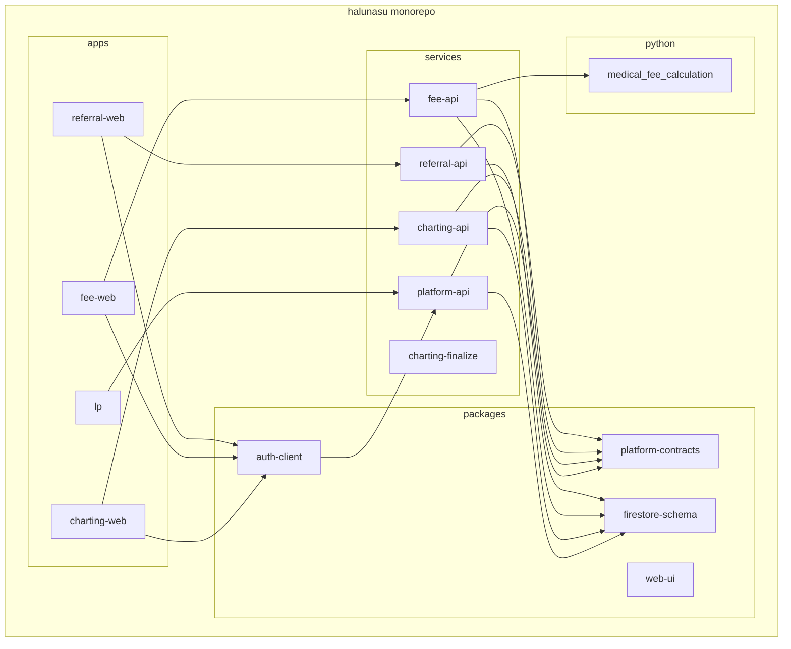

## TOBE: GCP Project Topology

Create new projects instead of carrying historical project boundaries forward.

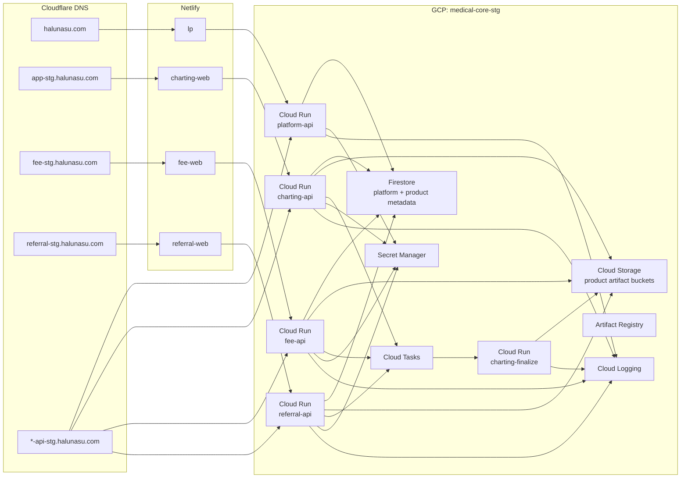

Production mirrors staging:

```text
medical-core-stg    -> staging, preview, synthetic/non-production PHI policy
medical-core-497610 -> production/core, real PHI, stricter IAM, backup, retention, audit
```

Initial cost controls:

- Cloud Run request-based billing
- `min-instances=0` for staging
- `max-instances=1` for staging
- Firestore Native mode
- No GKE, VM, Cloud SQL, NAT, or external Load Balancer in the initial phase
- Cloud Storage lifecycle policies from the start

## TOBE: Shared Platform DB Boundary

```mermaid
flowchart TB
  subgraph Platform["Shared Platform/Core collections"]
    ORG2["organizations/{orgId}"]
    OC2["organization_codes/{organizationCode}"]
    LI2["login_identities/{organizationCode:loginId}"]
    MEM2["organizations/{orgId}/members/{memberId}"]
    FAC2["organizations/{orgId}/facilities/{facilityId}"]
    DEP2["organizations/{orgId}/departments/{departmentId}"]
    PAT2["organizations/{orgId}/patients/{patientId}"]
    ALIAS2["organizations/{orgId}/patients/{patientId}/aliases/{aliasId}"]
    ENT2["organizations/{orgId}/product_entitlements/{productId}"]
    AUD2["organizations/{orgId}/audit_events/{eventId}"]
  end

  subgraph Charting["Charting product data"]
    CENC["organizations/{orgId}/charting_encounters/{encounterId}"]
    CTURN["turns / transcript refs"]
    SOAP["soap_versions"]
    AUDIO["GCS audio / transcript artifacts"]
  end

  subgraph Fee["Fee calculation product data"]
    FSES["organizations/{orgId}/fee_sessions/{feeSessionId}"]
    JOBS["jobs / extractions / review_items"]
    REC["receipt draft metadata"]
    FART["GCS calculation artifacts / masters"]
  end

  subgraph Referral["Referral product data"]
    REF["organizations/{orgId}/referrals/{referralId}"]
    RDRAFT["drafts / workflow status"]
    RPDF["GCS PDFs / attachments"]
    RTPL["recipient templates"]
  end

  PAT2 -->|"patientId + snapshot"| CENC
  PAT2 -->|"patientId + patient_ref + snapshot"| FSES
  PAT2 -->|"patientId + snapshot"| REF
  FAC2 --> CENC
  FAC2 --> FSES
  FAC2 --> REF
  DEP2 --> CENC
  DEP2 --> FSES
  DEP2 --> REF
```

Rule:

- Product records store `orgId`, `patientId`, and a product-local snapshot.
- Product services do not read sibling product records directly.
- Cross-product reuse, such as turning a SOAP note into a referral draft, must be an explicit user action through an API, not an implicit database dependency.

## TOBE: Firestore Entity Relationship

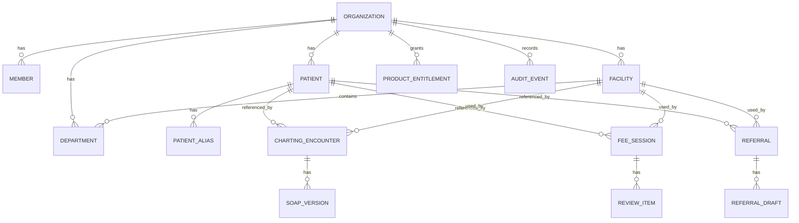

## TOBE: Patient Snapshot Pattern

The patient master is shared, but product records remain historically reproducible.

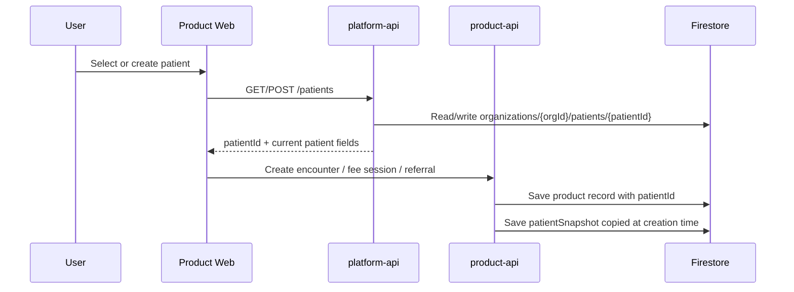

Example product record shape:

```json
{
  "orgId": "org_123",
  "patientId": "pat_456",
  "patientSnapshot": {
    "displayName": "山田 太郎",
    "displayNameKana": "ヤマダ タロウ",
    "birthDate": "1970-01-01",
    "sex": "male"
  }
}
```

## TOBE: Authentication And Authorization

`platform-api` owns login, session, MFA, CSRF, members, product entitlements, and roles.

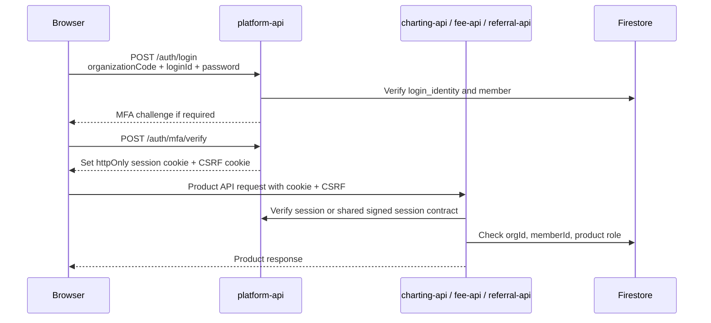

Role model:

```text
globalRoles:
  - org_admin
  - doctor
  - nurse
  - billing_admin

productRoles:
  charting:
    - admin
    - doctor
    - recorder
  fee:
    - admin
    - reviewer
    - doctor
  referral:
    - admin
    - doctor
```

## TOBE: Signup And LP

LP remains a static entry point. Signup belongs to Platform.

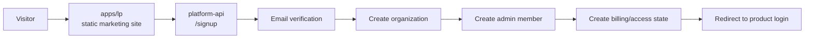

No LP database writes. No LP-specific signup backend.

## TOBE: Product Data Flow

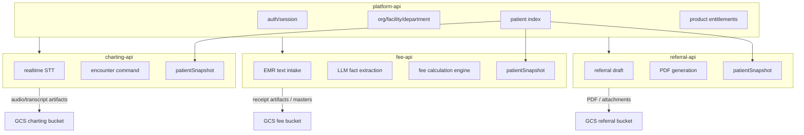

## Migration Plan

With no customers, migration can be a clean cutover rather than a compatibility migration.

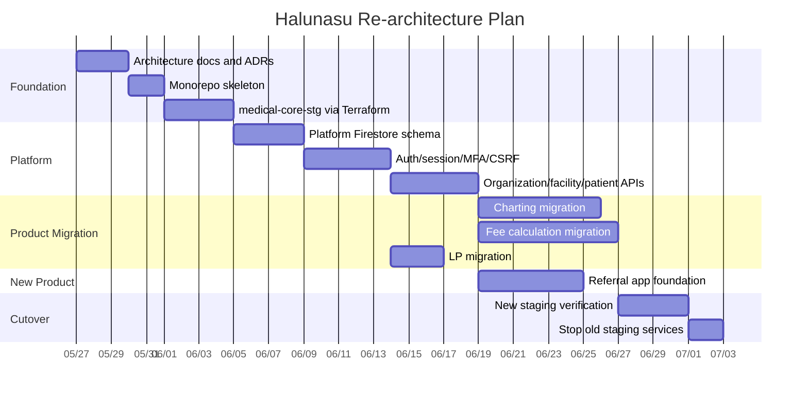

## Repository Decision

Use a new monorepo.

Reasons:

- Current customer count is zero, so migration compatibility has low value.
- Cross-product schema and auth need one source of truth.
- Referral app should not be added as a fourth independent repository.
- Python fee calculation code can remain Python while sharing deployment, contracts, docs, and infrastructure.
- Existing repositories can become migration sources and later archives.

## GCP Decision

Use the newly created core projects.

```text
medical-core-stg
medical-core-497610
```

Do not keep expanding:

- `medical-stg-493105`
- `medical-492407`
- `medical-fee-calculation`
- `medical-fee-calculation-stg`

Reasons:

- Current projects encode historical boundaries.
- Fee calculation currently has its own staging project and operator auth.
- A new Platform DB is easier to reason about in a clean project.
- IAM, Secret Manager, Firestore, GCS, and Cloud Run naming can be made consistent from the start.

## Open Implementation Choices

These should be decided before code migration:

- Whether product metadata should be stored as org subcollections or top-level product collections with `orgId`.
- Whether product APIs verify sessions by calling `platform-api` or by validating a shared signed session token locally.
- Whether `platform-api` and `charting-api` start as separate Cloud Run services immediately or begin in one Node service and split later.
- Whether Cloud Run custom domains are enough for production launch or whether a Load Balancer is needed later for WAF, mTLS, or centralized routing.
- Whether patient alias matching should be exact-only at first or include fuzzy candidate generation.

## Non-goals

- Do not merge all clinical data into a single product-neutral collection.
- Do not let product services read sibling product records directly.
- Do not store large clinical text, audio, PDFs, or calculation artifacts in Firestore.
- Do not make LP responsible for signup persistence.
- Do not keep `OPERATOR_ACCOUNTS_JSON` as a production auth source.
