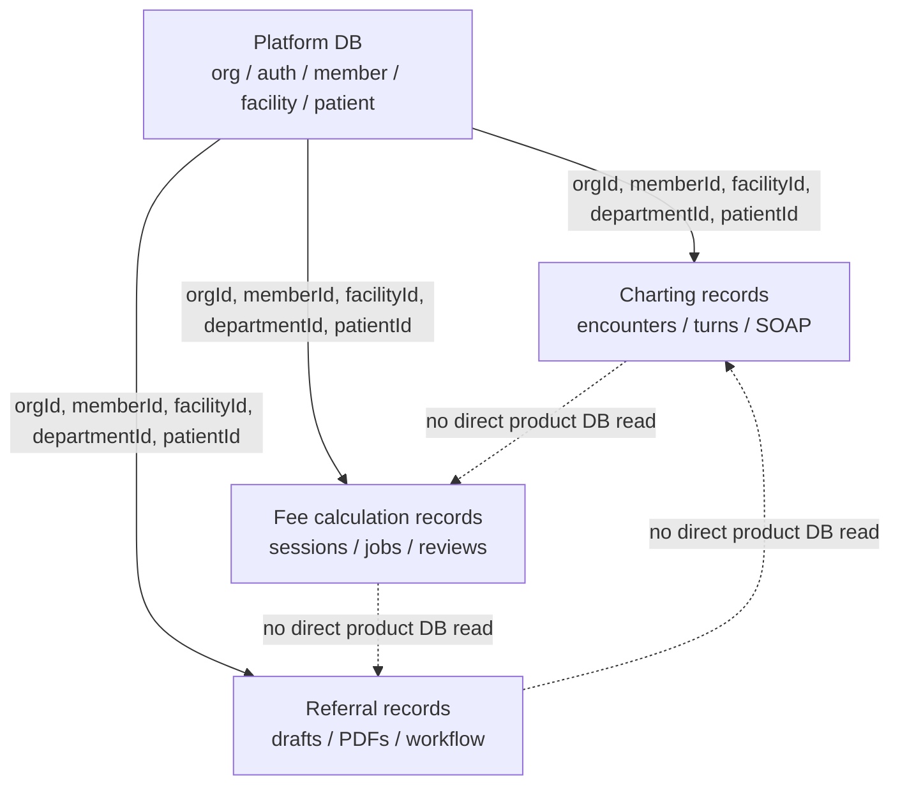
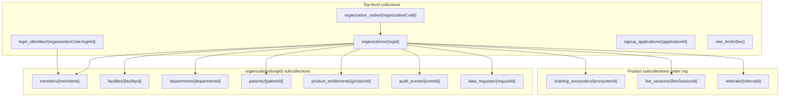

# Platform Data Model

Status: draft  
Date: 2026-05-27  
Owner: Halunasu platform

## Purpose

This document defines the first target data model for the unified Halunasu platform.

The goal is to centralize the data that should be common across charting, medical fee calculation, and referral letter creation, while keeping clinical artifacts owned by each product.

## Core Principle

Use shared master data for identity and routing. Keep product records independently reproducible.



Rules:

- `platform-api` owns shared master data.
- Product APIs may read shared Platform records through a shared library or Platform API contract.
- Product APIs must not read sibling product records directly.
- Product records must store snapshots of shared records needed for historical output.
- Large text/audio/PDF/CSV/JSON artifacts go to Cloud Storage, not Firestore.

## ID Strategy

Use opaque stable IDs for internal references. Keep human or external IDs as aliases.

| Entity | ID format | Scope | Notes |
| --- | --- | --- | --- |
| Organization | `org_<ulid>` | Global | Primary tenant boundary |
| Organization code | lowercase slug | Global | Human login code, unique |
| Member | `mem_<ulid>` | Per org | Login identity may map to member |
| Facility | `fac_<ulid>` | Per org | Medical institution profile |
| Department | `dep_<ulid>` | Per org | Can belong to facility |
| Patient | `pat_<ulid>` | Per org | No global patient identity in initial version |
| Encounter | `enc_<ulid>` | Per org | Charting product |
| Fee session | `fee_<ulid>` | Per org | Fee calculation product |
| Referral | `ref_<ulid>` | Per org | Referral product |

Use ULID or another sortable random ID. Do not encode names, dates, or PHI into IDs.

## Timestamp And Version Rules

- Store timestamps as Firestore `Timestamp`.
- API responses can serialize them as ISO 8601 UTC strings.
- Every mutable document has `createdAt`, `updatedAt`, and `schemaVersion`.
- Documents that affect medical output should include `sourceVersion` or `snapshotVersion` where applicable.
- Product outputs should preserve the prompt/model/master version used to generate them.

## Collection Overview



## Platform Collections

### `organizations/{orgId}`

Authoritative tenant record.

| Field | Type | Required | Notes |
| --- | --- | --- | --- |
| `orgId` | string | yes | Same as document ID |
| `organizationCode` | string | yes | Login code, unique, lowercase |
| `displayName` | string | yes | UI name |
| `legalName` | string | no | Contract/billing name |
| `status` | string | yes | `active`, `trialing`, `suspended`, `closed` |
| `timezone` | string | yes | Default `Asia/Tokyo` |
| `locale` | string | yes | Default `ja-JP` |
| `billing` | map | yes | Stripe/customer/plan/status summary |
| `access` | map | yes | Product access gates |
| `defaultFacilityId` | string | no | Default facility |
| `defaultDepartmentId` | string | no | Default department |
| `createdAt` | timestamp | yes |  |
| `updatedAt` | timestamp | yes |  |
| `schemaVersion` | number | yes | Initial `1` |

Recommended `access` shape:

```json
{
  "status": "active",
  "enabledProducts": ["charting", "fee", "referral"],
  "trialEndsAt": "2026-06-30T00:00:00.000Z"
}
```

### `organization_codes/{organizationCode}`

Unique lookup from login code to organization.

| Field | Type | Required | Notes |
| --- | --- | --- | --- |
| `organizationCode` | string | yes | Same as document ID |
| `orgId` | string | yes | Target organization |
| `status` | string | yes | `active`, `reserved`, `disabled` |
| `createdAt` | timestamp | yes |  |
| `updatedAt` | timestamp | yes |  |

### `login_identities/{organizationCode:loginId}`

Authentication identity. This remains top-level for efficient login lookup.

| Field | Type | Required | Notes |
| --- | --- | --- | --- |
| `identityKey` | string | yes | Same as document ID |
| `organizationCode` | string | yes |  |
| `loginId` | string | yes | Human login ID |
| `orgId` | string | yes | Resolved org |
| `memberId` | string | yes | Linked member |
| `passwordHash` | string | yes | Strong hash only |
| `passwordUpdatedAt` | timestamp | no |  |
| `tokenVersion` | number | yes | Increment to revoke sessions |
| `mfaRequired` | boolean | yes |  |
| `mfaEnrolled` | boolean | yes | Secret itself should be encrypted |
| `status` | string | yes | `active`, `locked`, `disabled` |
| `failedLoginCount` | number | yes |  |
| `lockedUntil` | timestamp | no |  |
| `createdAt` | timestamp | yes |  |
| `updatedAt` | timestamp | yes |  |

### `organizations/{orgId}/members/{memberId}`

Human operator/member profile.

| Field | Type | Required | Notes |
| --- | --- | --- | --- |
| `memberId` | string | yes | Same as document ID |
| `orgId` | string | yes |  |
| `loginId` | string | yes |  |
| `displayName` | string | yes |  |
| `email` | string | no |  |
| `status` | string | yes | `active`, `invited`, `disabled` |
| `globalRoles` | array | yes | `org_admin`, `doctor`, `nurse`, `billing_admin` |
| `productRoles` | map | yes | Per product roles |
| `facilityIds` | array | yes | Empty means no explicit facility grant |
| `departmentIds` | array | yes | Empty means no explicit department grant |
| `defaultFacilityId` | string | no |  |
| `defaultDepartmentId` | string | no |  |
| `createdAt` | timestamp | yes |  |
| `updatedAt` | timestamp | yes |  |

Example:

```json
{
  "globalRoles": ["doctor"],
  "productRoles": {
    "charting": ["doctor"],
    "fee": ["reviewer"],
    "referral": ["doctor"]
  }
}
```

### `organizations/{orgId}/facilities/{facilityId}`

Medical institution/facility profile. Fee calculation should read medical institution metadata from here instead of maintaining a separate tenant profile.

| Field | Type | Required | Notes |
| --- | --- | --- | --- |
| `facilityId` | string | yes | Same as document ID |
| `orgId` | string | yes |  |
| `displayName` | string | yes |  |
| `legalName` | string | no |  |
| `facilityType` | string | no | `clinic`, `hospital`, etc. |
| `medicalInstitutionCode` | string | no | Receipt/fee context |
| `regionalBureau` | string | no | Fee calculation regional context |
| `prefecture` | string | no |  |
| `address` | map | no | Postal/address components |
| `phone` | string | no |  |
| `facilityStandardKeys` | array | yes | Fee calculation standard flags/keys |
| `status` | string | yes | `active`, `inactive` |
| `createdAt` | timestamp | yes |  |
| `updatedAt` | timestamp | yes |  |

### `organizations/{orgId}/departments/{departmentId}`

Clinical department or operational unit.

| Field | Type | Required | Notes |
| --- | --- | --- | --- |
| `departmentId` | string | yes | Same as document ID |
| `orgId` | string | yes |  |
| `facilityId` | string | no | If department belongs to a specific facility |
| `displayName` | string | yes |  |
| `code` | string | no | Local department code |
| `specialty` | string | no | Normalized specialty key |
| `status` | string | yes | `active`, `inactive` |
| `createdAt` | timestamp | yes |  |
| `updatedAt` | timestamp | yes |  |

### `organizations/{orgId}/patients/{patientId}`

Organization-scoped patient index.

No global patient matching in the first version. A patient belongs to one organization.

| Field | Type | Required | Notes |
| --- | --- | --- | --- |
| `patientId` | string | yes | Same as document ID |
| `orgId` | string | yes |  |
| `displayName` | string | yes |  |
| `displayNameKana` | string | no |  |
| `birthDate` | string | no | `YYYY-MM-DD` |
| `sex` | string | no | `male`, `female`, `other`, `unknown` |
| `externalPatientIds` | array | yes | Non-PHI aliases, or hashed where needed |
| `status` | string | yes | `active`, `merged`, `inactive` |
| `mergedIntoPatientId` | string | no | Only when `status=merged` |
| `notes` | string | no | Avoid clinical narrative here |
| `createdAt` | timestamp | yes |  |
| `updatedAt` | timestamp | yes |  |

Keep the patient master minimal. Clinical notes, transcripts, receipt artifacts, and referral body text do not belong here.

### `organizations/{orgId}/patients/{patientId}/aliases/{aliasId}`

External and local patient identifiers.

| Field | Type | Required | Notes |
| --- | --- | --- | --- |
| `aliasId` | string | yes | Same as document ID |
| `sourceSystem` | string | yes | `manual`, `emr`, `receipt`, etc. |
| `externalId` | string | no | Only if acceptable to store directly |
| `externalIdHash` | string | no | Preferred for sensitive IDs |
| `label` | string | no | Human readable source label |
| `confidence` | string | yes | `verified`, `candidate`, `rejected` |
| `createdAt` | timestamp | yes |  |
| `updatedAt` | timestamp | yes |  |

### `organizations/{orgId}/product_entitlements/{productId}`

Product access and plan control.

| Field | Type | Required | Notes |
| --- | --- | --- | --- |
| `productId` | string | yes | `charting`, `fee`, `referral` |
| `status` | string | yes | `enabled`, `trialing`, `disabled` |
| `plan` | string | no | Product-specific plan |
| `limits` | map | yes | Usage limits |
| `features` | map | yes | Feature flags |
| `startsAt` | timestamp | no |  |
| `endsAt` | timestamp | no |  |
| `createdAt` | timestamp | yes |  |
| `updatedAt` | timestamp | yes |  |

### `organizations/{orgId}/audit_events/{eventId}`

Platform audit index. Product-specific details can be stored in product collections, but security-sensitive operations should be visible here.

| Field | Type | Required | Notes |
| --- | --- | --- | --- |
| `eventId` | string | yes | Same as document ID |
| `orgId` | string | yes |  |
| `eventType` | string | yes |  |
| `actorMemberId` | string | no |  |
| `actorLoginId` | string | no |  |
| `productId` | string | no |  |
| `targetType` | string | no | `patient`, `member`, `encounter`, etc. |
| `targetId` | string | no |  |
| `safePayload` | map | yes | Never include large PHI |
| `createdAt` | timestamp | yes |  |

## Product Collections

Product records live under the organization boundary. This keeps tenant cleanup and authorization simple.

### `organizations/{orgId}/charting_encounters/{encounterId}`

Migrated from the current `medical` encounter/session model.

Required shared references:

- `orgId`
- `facilityId`
- `departmentId`
- `patientId` where known
- `patientSnapshot`
- `createdByMemberId`

Product-owned data:

- Encounter title
- Visit reason
- Recording status
- Transcript references
- SOAP versions
- Prompt profile snapshot
- GCS artifact paths

### `organizations/{orgId}/fee_sessions/{feeSessionId}`

Migrated from `medical-fee-calculation` chart bundles/calculation sessions.

Required shared references:

- `orgId`
- `facilityId`
- `departmentId`
- `patientId` where known
- `patient_ref` for backward compatibility with EMR/receipt input
- `patientSnapshot`
- `createdByMemberId`

Product-owned data:

- `record_id`
- Encounter/service metadata
- Extraction jobs
- Review items
- Receipt draft metadata
- Master version
- LLM prompt/model/schema versions
- GCS artifact paths

### `organizations/{orgId}/referrals/{referralId}`

New product collection.

Required shared references:

- `orgId`
- `facilityId`
- `departmentId`
- `patientId`
- `patientSnapshot`
- `authorMemberId`

Product-owned data:

- Referral status
- Recipient institution/doctor snapshot
- Draft content
- Source references selected by user
- Generated PDF paths
- Sending/export status

## Patient Snapshot Contract

Every product record that references a patient must copy the patient fields needed to reproduce the product output.

Minimum snapshot:

```json
{
  "patientId": "pat_01HY...",
  "displayName": "山田 太郎",
  "displayNameKana": "ヤマダ タロウ",
  "birthDate": "1970-01-01",
  "sex": "male",
  "snapshotAt": "2026-05-27T00:00:00.000Z"
}
```

Do not update historical product snapshots automatically when the patient master changes.

## Cloud Storage Layout

Use product-specific buckets to reduce accidental cross-product access.

```text
gs://halunasu-stg-charting-artifacts/
  orgs/{orgId}/encounters/{encounterId}/audio/{objectId}
  orgs/{orgId}/encounters/{encounterId}/transcripts/{objectId}
  orgs/{orgId}/encounters/{encounterId}/soap/{objectId}

gs://halunasu-stg-fee-artifacts/
  orgs/{orgId}/fee-sessions/{feeSessionId}/inputs/{objectId}
  orgs/{orgId}/fee-sessions/{feeSessionId}/extractions/{objectId}
  orgs/{orgId}/fee-sessions/{feeSessionId}/receipts/{objectId}
  masters/{sourceVersion}/{objectId}

gs://halunasu-stg-referral-artifacts/
  orgs/{orgId}/referrals/{referralId}/drafts/{objectId}
  orgs/{orgId}/referrals/{referralId}/pdf/{objectId}
  orgs/{orgId}/referrals/{referralId}/attachments/{objectId}
```

Production uses the same layout with `halunasu-prod-*` bucket names.

## Initial Firestore Indexes

Avoid unnecessary composite indexes until the first real screens require them.

Recommended initial indexes:

| Collection group | Fields | Purpose |
| --- | --- | --- |
| `members` | `orgId`, `status`, `updatedAt desc` | Admin member list |
| `patients` | `orgId`, `status`, `updatedAt desc` | Patient list |
| `patients` | `orgId`, `displayNameKana` | Patient search prefix base |
| `facilities` | `orgId`, `status`, `displayName` | Facility settings |
| `charting_encounters` | `orgId`, `patientId`, `createdAt desc` | Patient charting history |
| `charting_encounters` | `orgId`, `createdAt desc` | Encounter dashboard |
| `fee_sessions` | `orgId`, `patientId`, `createdAt desc` | Patient fee history |
| `fee_sessions` | `orgId`, `createdAt desc` | Fee dashboard |
| `referrals` | `orgId`, `patientId`, `createdAt desc` | Patient referral history |
| `referrals` | `orgId`, `status`, `updatedAt desc` | Referral work queue |
| `audit_events` | `orgId`, `createdAt desc` | Audit review |

## Security And Access Rules

- Browser clients do not access Firestore or GCS directly for PHI.
- Product APIs enforce org/member/product authorization.
- Firestore security rules should deny client direct access by default.
- Cloud Storage objects are private.
- Signed URLs should be short-lived and only returned by product APIs after authorization.
- Product service accounts should only access their own buckets plus the shared Firestore database.
- `platform-api` is the only service allowed to mutate Platform master collections.

## ASIS To TOBE Mapping

| Current source | Current field/collection | Target |
| --- | --- | --- |
| `medical` | `organizations` | `organizations` |
| `medical` | `organization_codes` | `organization_codes` |
| `medical` | `login_identities` | `login_identities` |
| `medical` | `members` | `organizations/{orgId}/members` |
| `medical` | `signup_applications` | `signup_applications` owned by `platform-api` |
| `medical` | `encounters` | `organizations/{orgId}/charting_encounters` |
| `medical` | `patientDisplayName` / `patientSnapshot` | `patients` plus product `patientSnapshot` |
| `medical-fee-calculation` | `tenant_id` | `orgId` |
| `medical-fee-calculation` | `tenant_members` | `members` / `productRoles.fee` |
| `medical-fee-calculation` | `OPERATOR_ACCOUNTS_JSON` | removed, replaced by Platform login |
| `medical-fee-calculation` | `chart_bundles` | `organizations/{orgId}/fee_sessions` |
| `medical-fee-calculation` | `patient_ref` | `patient_ref` plus optional shared `patientId` |
| `medical-fee-calculation` | `facility.medical_institution_code` | `facilities.medicalInstitutionCode` snapshot into fee session |
| `medical-lp` | CTA to app signup | `apps/lp` CTA to `platform-api` signup |

## Open Questions

- Should patient search include fuzzy candidate generation in Platform v1, or exact/prefix search only?
- Should product records be org subcollections forever, or should high-volume products move to top-level collections later?
- Should `platform-api` expose internal HTTP endpoints for product services, or should product services validate signed session tokens locally?
- Which patient fields are required for referral letter v1?
- Which facility standard keys should be normalized for fee calculation v1?

