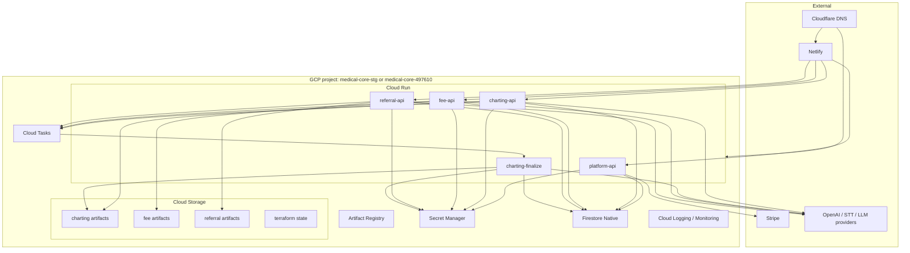
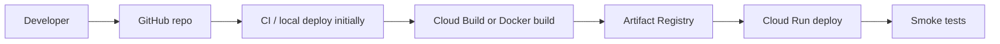

# GCP Environment Plan

Status: draft  
Date: 2026-05-27  
Owner: Halunasu platform

## Purpose

This document defines the first GCP target environment for Halunasu.

Because there are no current customers, the target is a clean core environment instead of expanding the historical product projects.

## Decision

Use the newly created core GCP projects:

```text
medical-core-stg
medical-core-497610
```

Current role:

| Project display/name | Project ID / number | Role |
| --- | --- | --- |
| `medical-core-stg` | `medical-core-stg` | New staging core/runtime project |
| `medical-core` | `medical-core-497610` | New production/core runtime project |
| `halunasu.com` | `634072823240` | Domain-related GCP entry/project; not the primary runtime project |

Do not continue product expansion in the historical product projects:

```text
medical-stg-493105
medical-492407
medical-fee-calculation
medical-fee-calculation-stg
```

Those projects become migration sources and later shutdown/archive candidates.

## Environment Topology



## Region

Use one primary region initially:

```text
asia-northeast1
```

Reasons:

- Existing services already use Tokyo.
- Most expected users are in Japan.
- Firestore, Cloud Run, Cloud Tasks, and Storage can be kept operationally simple.

## Hosting And Domains

Netlify remains the frontend host for the initial phase. Cloud Run hosts APIs and workers.

### Staging

| Surface | Domain | Host |
| --- | --- | --- |
| LP | `halunasu.com` or `stg.halunasu.com` during preview | Netlify |
| Charting web | `app-stg.halunasu.com` | Netlify |
| Fee web | `fee-stg.halunasu.com` | Netlify |
| Referral web | `referral-stg.halunasu.com` | Netlify |
| Platform API | `platform-api-stg.halunasu.com` | Cloud Run |
| Charting API | `charting-api-stg.halunasu.com` | Cloud Run |
| Fee API | `fee-api-stg.halunasu.com` | Cloud Run |
| Referral API | `referral-api-stg.halunasu.com` | Cloud Run |

### Production

| Surface | Domain | Host |
| --- | --- | --- |
| LP | `halunasu.com` | Netlify |
| Charting web | `app.halunasu.com` | Netlify |
| Fee web | `fee.halunasu.com` | Netlify |
| Referral web | `referral.halunasu.com` | Netlify |
| Platform API | `platform-api.halunasu.com` | Cloud Run |
| Charting API | `charting-api.halunasu.com` | Cloud Run |
| Fee API | `fee-api.halunasu.com` | Cloud Run |
| Referral API | `referral-api.halunasu.com` | Cloud Run |

Important first step:

- Verify `halunasu.com` in GCP before relying on Cloud Run custom domains.

## Cloud Run Services

| Service | Runtime | Source | Public ingress | Auth model |
| --- | --- | --- | --- | --- |
| `platform-api` | Node.js | `services/platform-api` | yes | App session, CSRF, internal service auth |
| `charting-api` | Node.js | `services/charting-api` | yes | Platform session required |
| `charting-finalize` | Node.js | `services/charting-finalize` | internal/task-only preferred | Cloud Tasks OIDC |
| `fee-api` | Python/FastAPI | `services/fee-api` + `python/medical_fee_calculation` | yes | Platform session required |
| `referral-api` | Node.js or Python | `services/referral-api` | yes | Platform session required |

Initial staging settings:

```text
min-instances=0
max-instances=1
cpu=request-based
concurrency=20
region=asia-northeast1
```

Initial production settings:

```text
min-instances=0
max-instances=3
cpu=request-based
concurrency=40
region=asia-northeast1
```

Increase production min instances only after latency requirements justify the cost.

## Service Accounts

Use one service account per service.

| Service account | Used by | Purpose |
| --- | --- | --- |
| `halunasu-platform-api@PROJECT.iam.gserviceaccount.com` | `platform-api` | Platform DB, signup, billing, auth |
| `halunasu-charting-api@PROJECT.iam.gserviceaccount.com` | `charting-api` | Charting DB, charting GCS, task enqueue |
| `halunasu-charting-finalize@PROJECT.iam.gserviceaccount.com` | `charting-finalize` | Final transcript/SOAP worker |
| `halunasu-fee-api@PROJECT.iam.gserviceaccount.com` | `fee-api` | Fee DB, fee GCS, masters |
| `halunasu-referral-api@PROJECT.iam.gserviceaccount.com` | `referral-api` | Referral DB, referral GCS |
| `halunasu-cloud-tasks@PROJECT.iam.gserviceaccount.com` | Cloud Tasks | OIDC task invocation |
| `halunasu-deployer@PROJECT.iam.gserviceaccount.com` | CI/CD | Build/deploy only |

## IAM Plan

Keep IAM coarse enough to move quickly, but not shared across all services.

### Project-level roles

| Principal | Roles |
| --- | --- |
| Cloud Run service accounts | `roles/datastore.user` |
| Cloud Run service accounts | `roles/logging.logWriter` |
| Service accounts needing secrets | `roles/secretmanager.secretAccessor` on specific secrets only |
| `halunasu-deployer` | Cloud Run deploy, Artifact Registry writer, service account user |

Avoid broad owner/editor roles for runtime service accounts.

### Bucket-level roles

| Bucket | Principals | Role |
| --- | --- | --- |
| `medical-core-stg-charting-artifacts` / `medical-core-497610-charting-artifacts` | charting-api, charting-finalize | `roles/storage.objectUser` |
| `medical-core-stg-fee-artifacts` / `medical-core-497610-fee-artifacts` | fee-api | `roles/storage.objectUser` |
| `medical-core-stg-referral-artifacts` / `medical-core-497610-referral-artifacts` | referral-api | `roles/storage.objectUser` |
| `medical-core-stg-tfstate` / `medical-core-497610-tfstate` | Terraform/deployer identity | minimal state access |

Do not grant fee-api access to charting audio by default.

## Firestore

One Firestore Native database per environment.

```text
database: (default)
location: asia-northeast1
mode: Native
```

Client direct access:

- Deny by default.
- All browser access goes through APIs.

Backups:

- Enable scheduled backups before production PHI.
- Run restore drill before production launch.

## Cloud Storage Buckets

Staging:

```text
medical-core-stg-charting-artifacts
medical-core-stg-fee-artifacts
medical-core-stg-referral-artifacts
medical-core-stg-tfstate
```

Production:

```text
medical-core-497610-charting-artifacts
medical-core-497610-fee-artifacts
medical-core-497610-referral-artifacts
medical-core-497610-tfstate
```

Default bucket settings:

- Uniform bucket-level access: enabled
- Public access prevention: enforced
- Object versioning: enabled for production artifact buckets where useful
- Lifecycle rules: enabled
- Retention policy: define before production PHI

## Cloud Tasks

Queues:

| Queue | Producer | Consumer | Purpose |
| --- | --- | --- | --- |
| `charting-finalize` | `charting-api` | `charting-finalize` | Final transcript/SOAP |
| `fee-extraction` | `fee-api` | `fee-api` or future worker | Long LLM extraction |
| `referral-render` | `referral-api` | `referral-api` or future worker | PDF rendering |

Initial queue settings:

```text
max-dispatches-per-second=1 for staging
max-concurrent-dispatches=1 for staging
```

Use Cloud Tasks OIDC instead of shared HMAC for worker invocation where possible.

## Secret Manager

Minimum secrets:

| Secret | Services |
| --- | --- |
| `APP_SESSION_SIGNING_SECRET` | platform-api, product APIs if local verification |
| `APP_FIELD_ENCRYPTION_KEY` | platform-api, product APIs requiring encrypted fields |
| `CSRF_SIGNING_SECRET` | platform-api |
| `OPENAI_API_KEY` | charting-api, charting-finalize, fee-api, referral-api as needed |
| `DEEPGRAM_API_KEY` | charting-api if fallback remains |
| `STRIPE_SECRET_KEY` | platform-api |
| `STRIPE_WEBHOOK_SECRET` | platform-api |
| `INTERNAL_SERVICE_TOKEN` | only if needed before OIDC is complete |

Do not keep `OPERATOR_ACCOUNTS_JSON` in the target production design.

## Artifact Registry

Repository:

```text
halunasu-services
```

Images:

```text
platform-api
charting-api
charting-finalize
fee-api
referral-api
```

Tags:

```text
git-sha
environment
```

Example:

```text
asia-northeast1-docker.pkg.dev/PROJECT/halunasu-services/platform-api:git-abcdef0
```

## Terraform Layout

Recommended repository layout:

```text
infra/gcp/
  modules/
    project_services/
    service_accounts/
    firestore/
    storage_buckets/
    cloud_run_service/
    cloud_tasks_queue/
    secrets/
    artifact_registry/
  envs/
    stg/
      main.tf
      variables.tf
      terraform.tfvars
    prod/
      main.tf
      variables.tf
      terraform.tfvars
```

Terraform should manage infrastructure. Secret values should be inserted outside Terraform unless there is a secure workflow for sensitive state.

## Deployment Flow



Initial deployment can be manual while the architecture is moving quickly. Before production, CI should enforce:

- tests
- build
- secret scanning
- image build
- deploy approval
- smoke tests

## Monitoring And Logging

Minimum production readiness:

- Cloud Run error rate alert
- Cloud Run latency alert
- Cloud Run 5xx alert
- Firestore quota/cost alert
- GCS object growth alert
- LLM token/cost counters per org/product
- Audit log export policy
- PHI-safe application logs

Do not log:

- Patient names
- Birth dates
- Raw chart text
- Transcript text
- Insurance IDs
- Referral body text
- Receipt artifact contents

## Cost Guardrails

Initial staging:

- Cloud Run min instances: `0`
- Cloud Run max instances: `1`
- No Cloud SQL
- No GKE
- No VM
- No NAT
- No external HTTPS Load Balancer
- No BigQuery unless separately approved
- Disable scheduled high-cost jobs by default

Production before first customer:

- Same as staging except stricter backups and alerts.
- Add min instances only after real latency testing.

## Migration Cutover Approach

Because there are no customers:

1. Build new staging in `medical-core-stg`.
2. Migrate code into the monorepo.
3. Seed only demo/test organizations and synthetic patients.
4. Stop using old staging services once feature parity is confirmed.
5. Keep old GCP projects for a short rollback window.
6. Delete or disable old resources after the new staging is stable.

No production PHI migration is required at this point.

## Pre-production Checklist

- GCP domain verification completed.
- Firestore backup enabled and restore drill completed.
- GCS lifecycle policy configured.
- Secret access scoped per service.
- Runtime service accounts have no broad owner/editor roles.
- Cloud Run services use explicit service accounts.
- Public API docs disabled in production.
- CORS allowlist has only production domains.
- Netlify preview domains separated from production secrets.
- Stripe webhook endpoint moved to `platform-api`.
- Patient snapshot behavior tested.
- Audit events written for auth, member, patient, and product output operations.

## Deferred Decisions

- External HTTPS Load Balancer and Cloud Armor.
- Cloud SQL/PostgreSQL for analytics or complex relational workflows.
- BigQuery export for product analytics.
- Multi-region disaster recovery.
- Product-specific worker services beyond the initial Cloud Run API services.
