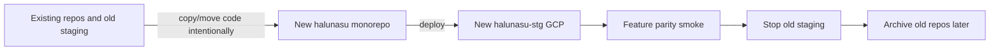

# Migration Execution Plan

Status: draft  
Date: 2026-05-27  
Owner: Halunasu platform

## Purpose

This document turns the ASIS/TOBE architecture into an execution plan.

The key assumption is that there are no current customers. Therefore, we can avoid compatibility-heavy migration and rebuild the staging architecture cleanly.

## Source Repositories

Local source repository names:

| Local directory | Current GitHub remote | Target role |
| --- | --- | --- |
| `halunasu-medical-record` | `k-hirade/medical` | Source for charting, Platform-like auth/org/signup/billing |
| `halunasu-fee-calculation` | `k-hirade/medical-fee-calculation` | Source for fee calculation UI/API/engine |
| `medical-lp` | `k-hirade/medical-lp` | Source for static LP |
| `halunasu` | not pushed yet | New target monorepo |

Existing GitHub repository names do not have to match local directory names. Remote URLs remain the source of truth for git push/pull.

## Target Repository Outcome

```text
halunasu/
  apps/
    lp/
    charting-web/
    fee-web/
    referral-web/
  services/
    platform-api/
    charting-api/
    charting-finalize/
    fee-api/
    referral-api/
  packages/
    platform-contracts/
    auth-client/
    web-ui/
    firestore-schema/
  python/
    medical_fee_calculation/
  infra/
    gcp/
  docs/
    architecture/
    runbooks/
```

## Migration Strategy

Use staged replacement instead of preserving all existing staging paths.



No production customer data migration is required now.

## Phase 0: Architecture Lock

Goal: decide the non-reversible boundaries before code moves.

Tasks:

- Approve monorepo shape.
- Approve new GCP project shape.
- Approve Platform DB schema.
- Approve product data boundaries.
- Decide whether product services verify sessions locally or call `platform-api`.
- Decide whether product metadata stays under `organizations/{orgId}` for v1.

Artifacts:

- `001-asis-tobe-architecture.md`
- `002-platform-data-model.md`
- `003-gcp-environment-plan.md`
- this execution plan

Exit criteria:

- No open disagreement on repository shape, GCP project shape, or Platform/Product data boundary.

## Phase 1: Monorepo Foundation

Goal: create a working repository skeleton without moving business logic yet.

Tasks:

- Add root package/workspace configuration.
- Add Python project conventions.
- Add formatter/lint/test command placeholders.
- Add shared `docs/runbooks`.
- Add `.env.example` files for each service.
- Add basic CI placeholder.
- Add local development README.

Recommended first structure:

```text
package.json
pyproject.toml
apps/lp/
apps/charting-web/
apps/fee-web/
apps/referral-web/
services/platform-api/
services/charting-api/
services/charting-finalize/
services/fee-api/
services/referral-api/
packages/platform-contracts/
packages/auth-client/
packages/firestore-schema/
python/medical_fee_calculation/
```

Exit criteria:

- `git status` clean.
- Root README documents how to run each future service.
- Empty or minimal service placeholders can build/test.

## Phase 2: New GCP Staging

Goal: create a clean `halunasu-stg-*` project ready for service deployment.

Tasks:

- Create GCP project.
- Enable required APIs.
- Create Artifact Registry.
- Create Firestore Native database.
- Create Cloud Storage buckets.
- Create service accounts.
- Create minimal IAM grants.
- Create Cloud Tasks queues.
- Create Secret Manager secret shells.
- Configure budget alert.
- Verify `halunasu.com` for Cloud Run custom domains.
- Add Terraform layout and import nothing from old projects.

Required APIs:

```text
run.googleapis.com
artifactregistry.googleapis.com
cloudbuild.googleapis.com
firestore.googleapis.com
storage.googleapis.com
secretmanager.googleapis.com
cloudtasks.googleapis.com
logging.googleapis.com
monitoring.googleapis.com
```

Exit criteria:

- `platform-api` placeholder can deploy to Cloud Run.
- Firestore write/read smoke works through server credentials.
- Buckets deny public access.
- Runtime service account IAM is service-specific.

## Phase 3: Platform API First

Goal: make Platform the source of truth before moving product behavior.

Tasks:

- Implement `organizations`.
- Implement `organization_codes`.
- Implement `login_identities`.
- Implement `members`.
- Implement password login.
- Implement session cookie.
- Implement CSRF.
- Implement MFA enrollment/verification.
- Implement signup application flow.
- Implement `facilities`.
- Implement `departments`.
- Implement `patients`.
- Implement `product_entitlements`.
- Implement audit event writer.

Suggested route groups:

```text
POST /v1/signup/applications
POST /v1/signup/verify-email
POST /v1/auth/login
POST /v1/auth/mfa/verify
POST /v1/auth/logout
GET  /v1/auth/session

GET/POST /v1/organizations
GET/PATCH /v1/organizations/{orgId}

GET/POST /v1/members
GET/PATCH /v1/members/{memberId}

GET/POST /v1/facilities
GET/PATCH /v1/facilities/{facilityId}

GET/POST /v1/departments
GET/PATCH /v1/departments/{departmentId}

GET/POST /v1/patients
GET/PATCH /v1/patients/{patientId}
```

Exit criteria:

- Can create a demo organization from signup.
- Can create an admin member.
- Can log in with organization code and login ID.
- Can enroll and verify MFA.
- Can create a patient.
- Audit events are written without PHI-heavy payloads.

## Phase 4: Charting Migration

Source: `halunasu-medical-record`.

Goal: move charting behavior while replacing Platform-owned pieces with `platform-api`.

Move:

- `apps/web` charting UI into `apps/charting-web`.
- `services/gateway` into `services/charting-api`.
- `services/finalize` into `services/charting-finalize`.
- session/encounter contracts into shared package where useful.
- prompt/SOAP/finalization logic.

Do not keep as-is:

- Organization provisioning in charting service.
- Signup/billing ownership in charting service.
- Product-specific login implementation.

Required changes:

- Charting API validates Platform session.
- Charting records use `orgId`.
- Encounter create accepts optional `patientId`.
- Encounter stores `patientSnapshot`.
- Audio/transcript/SOAP artifacts use the new charting GCS bucket.
- Cloud Tasks uses OIDC for finalize invocation where possible.

Exit criteria:

- Login through Platform.
- Create/select patient through Platform.
- Create charting encounter with `patientId`.
- Generate transcript/SOAP in staging.
- Product record can be reproduced from stored snapshot and artifacts.

## Phase 5: Fee Calculation Migration

Source: `halunasu-fee-calculation`.

Goal: move fee UI/API/engine while removing independent tenant/auth sources.

Move:

- `apps/web` into `apps/fee-web`.
- `apps/api` into `services/fee-api`.
- `src/medical_fee_calculation` into `python/medical_fee_calculation`.
- master data tooling into Python package or `tools/fee`.

Remove or replace:

- `OPERATOR_ACCOUNTS_JSON` as auth source.
- `tenant_members` as source of truth.
- Independent `tenant_id` as the primary tenant key.
- Staging collection prefix as the main product boundary.

Required changes:

- Fee API validates Platform session.
- `tenant_id` becomes `orgId` in API/storage.
- Keep `patient_ref` as external/source identifier.
- Add optional `patientId`.
- Store `patientSnapshot`.
- Resolve `medicalInstitutionCode` and `regionalBureau` from Platform `facility`.
- Store fee artifacts in the fee GCS bucket.
- Keep calculation engine independent from Platform-specific code.

Exit criteria:

- Login through Platform.
- Open fee UI.
- Start fee session for a Platform patient.
- Run synthetic extraction/calculation.
- Store session under `organizations/{orgId}/fee_sessions`.
- No production path depends on `OPERATOR_ACCOUNTS_JSON`.

## Phase 6: LP Migration

Source: `medical-lp`.

Goal: move LP into the monorepo and route signup to Platform.

Move:

- Static HTML/CSS/assets into `apps/lp`, or rebuild as a small static app if needed.
- Security headers / Netlify config.
- Privacy/security/legal pages.

Required changes:

- CTA points to Platform signup flow.
- No direct DB writes.
- No LP-specific signup backend.
- Footer/contact placeholders should be resolved or intentionally routed.

Exit criteria:

- LP builds/deploys from monorepo.
- CTA reaches Platform signup.
- Security headers present.
- Legal/privacy pages still accessible.

## Phase 7: Referral Foundation

Goal: create the new product using the target architecture from day one.

Build:

- `apps/referral-web`
- `services/referral-api`
- `organizations/{orgId}/referrals/{referralId}`
- Referral PDF/attachment bucket paths.

Required v1 data:

- `orgId`
- `facilityId`
- `departmentId`
- `patientId`
- `patientSnapshot`
- `authorMemberId`
- recipient institution snapshot
- draft body
- status
- generated PDF path

Referral should not directly read charting encounters. If a user wants to create a referral from a SOAP note, implement it as an explicit import action later.

Exit criteria:

- Login through Platform.
- Select patient.
- Create referral draft.
- Save draft.
- Generate PDF placeholder or real PDF.
- Store referral record and artifact paths.

## Phase 8: New Staging Verification

Goal: prove the new staging can replace the old staging.

Smoke tests:

- LP loads.
- Signup creates organization.
- Admin can set password/MFA.
- Admin can log in.
- Facility can be created.
- Patient can be created.
- Charting encounter can be created.
- Fee session can be created.
- Referral draft can be created.
- Audit events are written.
- GCS artifacts are private.
- Protected APIs reject unauthenticated requests.
- Product APIs reject users without entitlement.

Data checks:

- `organizations/{orgId}` exists.
- `members/{memberId}` exists.
- `patients/{patientId}` exists.
- Product records contain `patientSnapshot`.
- No large raw clinical body is stored directly in Platform patient docs.

Exit criteria:

- New staging supports the full demo path.
- Old staging is no longer needed for active development.

## Phase 9: Old Environment Shutdown

Because there are no customers, shutdown can be aggressive after verification.

Tasks:

- Stop old Cloud Run staging services.
- Disable old Netlify auto deploys or add clear banners/redirects.
- Freeze old Firestore writes.
- Export old staging data only if useful for debugging.
- Keep old projects for a short rollback window.
- Document deletion date.
- Archive old repos after code has been migrated and verified.

Do not delete old projects until:

- New staging has passed smoke tests.
- Any needed secrets/config examples have been copied.
- Any useful docs have been moved.

## Suggested Order Of First Commits

```text
1. architecture docs
2. monorepo skeleton
3. infra/gcp Terraform skeleton
4. platform-api minimal health/auth skeleton
5. platform Firestore schema and local tests
6. charting migration shell
7. fee migration shell
8. LP migration
9. referral app foundation
```

## Acceptance Criteria For The Architecture Migration

The re-architecture is successful when:

- There is one target monorepo.
- New GCP staging is the primary development environment.
- Platform owns org/member/login/facility/department/patient.
- Charting, fee calculation, and referral use Platform identity.
- No product owns a separate production auth source.
- Patient records are shared by product references.
- Product records store snapshots.
- Product artifacts are isolated in product buckets.
- LP routes signup to Platform.
- Old staging services are stopped or clearly deprecated.

## Risks And Mitigations

| Risk | Impact | Mitigation |
| --- | --- | --- |
| Monorepo migration stalls product work | Medium | Move in phases; keep old repos readable until replacement works |
| Platform API becomes too large | Medium | Keep Platform limited to shared master/auth/billing |
| Product data accidentally couples through Firestore | High | Enforce API-level boundaries and product-specific collections |
| Patient matching creates wrong merges | High | Start exact/manual; mark aliases as candidate unless verified |
| GCP custom domain setup blocks API routes | Medium | Verify domain early; use run.app only for temporary smoke |
| IAM becomes too broad during migration | High | One service account per service from the start |
| Firestore indexes expand without control | Low | Add indexes only for committed screens |
| Referral app imports charting data implicitly | Medium | Require explicit import action and audit event |

## Immediate Next Work

After this document:

1. Add monorepo skeleton files.
2. Add `infra/gcp` Terraform skeleton.
3. Add `platform-api` minimal health endpoint.
4. Define Platform contract schemas.
5. Implement organization/member/patient store tests before product migration.

