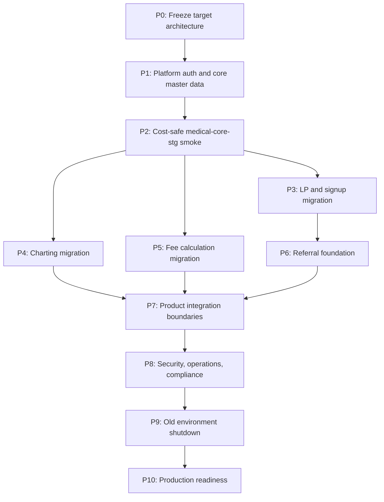

# Rearchitecture Completion Roadmap

Status: active  
Date: 2026-05-27  
Owner: Halunasu platform

## Purpose

This document defines the remaining steps to complete the Halunasu rearchitecture.

The goal is not just to migrate code. The goal is to finish with:

- one target monorepo
- one shared Platform/Core data layer
- product services separated by ownership
- no duplicated production auth source
- shared organization, facility, department, member, and patient model
- charting, fee calculation, and referral apps running on the new architecture
- old staging projects and old repos no longer needed for active development

## Cost Guardrail

Until there are customers, cost control has priority over convenience.

Hard constraints:

- No Terraform apply for now.
- No always-on Cloud Run.
- Cloud Run `min-instances=0`.
- Staging Cloud Run `max-instances=1`.
- No Cloud SQL.
- No VM.
- No GKE.
- No NAT.
- No external HTTPS Load Balancer.
- No Cloud Scheduler.
- No Cloud Tasks until async work is actually needed.
- No BigQuery.
- No public unauthenticated Platform API before auth is implemented.
- No LLM/STT secrets in `medical-core-stg` until a product flow needs them.

See [cost-control.md](../../infra/gcp/cost-control.md).

## Completion Definition

The rearchitecture is complete when all of these are true:

- `halunasu` is the primary development repository.
- `medical-core-stg` is the primary staging backend project.
- `medical-core-497610` is ready as the production/core project, but can remain mostly idle.
- `platform-api` owns org/member/login/facility/department/patient/product entitlement.
- Charting uses Platform org/member/patient/facility references.
- Fee calculation uses Platform org/member/patient/facility references.
- Referral app is built on Platform references from day one.
- Product records store snapshots and do not depend on mutable Platform master data for historical output.
- Product services do not read sibling product data directly.
- LP routes signup into Platform.
- Existing `halunasu-medical-record`, `halunasu-fee-calculation`, and `medical-lp` are migration sources only.
- Old staging services are stopped or clearly marked deprecated.

## Roadmap Overview



## P0: Freeze Target Architecture

Status: mostly done.

Purpose:

- Prevent the migration from drifting into a fourth architecture.

Remaining tasks:

- Confirm `organizations/{orgId}` subcollections remain the v1 product storage boundary.
- Confirm `platform-api` owns all shared master writes.
- Confirm product APIs can read Platform references but cannot mutate them except through Platform API.
- Confirm old product projects remain source/migration references only.
- Confirm no Terraform apply until a concrete operational need appears.

Exit criteria:

- `001` through `005` architecture docs are accepted as the working plan.
- Any deviation must be documented as a new architecture decision.

## P1: Platform Auth And Core Master Data

Status: complete for local implementation and tests. Not deployed to GCP yet.

Purpose:

- Make Platform usable as the source of truth before migrating products.

Tasks:

- Implement password hashing and password verification.
- Implement `login_identities`.
- Implement `organization_codes`.
- Implement member login by `organizationCode + loginId + password`.
- Implement signed httpOnly session cookie.
- Implement CSRF token/cookie.
- Implement logout and token version revocation.
- Implement MFA enrollment and verification for privileged roles.
- Implement `facilities`.
- Implement `departments`.
- Implement `product_entitlements`.
- Implement `audit_events`.
- Implement rate limits for login and signup.
- Add API tests for all above.

Required APIs:

```text
POST /v1/auth/login
POST /v1/auth/logout
GET  /v1/auth/session
POST /v1/auth/mfa/enroll
POST /v1/auth/mfa/verify

GET/POST/PATCH /v1/organizations
GET/POST/PATCH /v1/organizations/{orgId}/members
GET/POST/PATCH /v1/organizations/{orgId}/facilities
GET/POST/PATCH /v1/organizations/{orgId}/departments
GET/POST/PATCH /v1/organizations/{orgId}/patients
GET/POST/PATCH /v1/organizations/{orgId}/product-entitlements
```

Implemented route shape uses document-level `PATCH` endpoints, for example:

```text
PATCH /v1/organizations/{orgId}
PATCH /v1/organizations/{orgId}/members/{memberId}
PATCH /v1/organizations/{orgId}/facilities/{facilityId}
PATCH /v1/organizations/{orgId}/departments/{departmentId}
PATCH /v1/organizations/{orgId}/patients/{patientId}
PATCH /v1/organizations/{orgId}/product-entitlements/{productId}
```

Cost notes:

- Keep local tests on memory/fake Firestore.
- Do not deploy public unauthenticated API.
- Do not add Secret Manager secrets until session/MFA needs real keys.

Exit criteria:

- Demo org can be created.
- Admin member can be created.
- Admin can log in.
- MFA can be enrolled and verified.
- Session can be checked.
- Facilities/departments/patients can be created.
- Audit events are written for auth/member/patient operations.

## P2: Cost-safe `medical-core-stg` Smoke

Status: complete.

Purpose:

- Verify the Platform API can run in GCP without opening cost or security risk.

Tasks:

- Manually confirm billing alert exists for `medical-core-stg`.
- Manually confirm required APIs only.
- Run `scripts/preflight_platform_api_stg_p2.sh`.
- Manually create or confirm Artifact Registry repository only if deploying.
- Manually create or confirm `halunasu-platform-api` service account only if deploying.
- Grant only minimum required IAM.
- Deploy `platform-api-stg` with `scripts/deploy_platform_api_stg_zero_cost.sh --apply`.
- Keep Cloud Run `--no-allow-unauthenticated`.
- Smoke only `/readyz` first.
- Run one controlled Firestore write/read smoke only when intentionally verifying persistence.

Cost notes:

- Cloud Build and Artifact Registry may create small costs.
- Firestore reads/writes may create tiny usage.
- Do not run repeated write smoke tests.
- Do not create Cloud Storage buckets yet.
- Do not create Cloud Tasks yet.

Exit criteria:

- Cloud Run is deployed with `min-instances=0`.
- Cloud Run is not public.
- `/readyz` works with IAM-authenticated request.
- Firestore backend can write/read one demo org in a controlled smoke.
- Billing is checked after deploy.

## P3: LP And Signup Migration

Purpose:

- Move acquisition/signup to Platform and remove signup ownership from charting.

Tasks:

- Move `medical-lp` into `apps/lp`.
- Preserve legal/privacy/security pages.
- Preserve security headers.
- Replace CTA targets with Platform signup route.
- Implement Platform signup application collection.
- Implement email verification token model.
- Implement admin password setup token model.
- Implement organization/member provisioning from verified signup.
- Keep billing fields but avoid Stripe integration until needed.

Cost notes:

- LP can remain static and cheap on Netlify.
- Do not send real email until signup flow is ready.
- Use local/mock email in staging first.
- Do not integrate Stripe until billing flow is needed.

Exit criteria:

- LP builds from `halunasu`.
- Signup application can be created.
- Verification can provision organization and admin member.
- Admin can set password and log in.
- No LP direct database writes.

## P4: Charting Migration

Purpose:

- Move `halunasu-medical-record` charting behavior into the new architecture.

Tasks:

- Move `apps/web` to `apps/charting-web`.
- Move `services/gateway` to `services/charting-api`.
- Move `services/finalize` to `services/charting-finalize`.
- Move reusable contracts into `packages/platform-contracts` or a new product contract package.
- Replace charting-owned org/member/session auth with Platform session validation.
- Add `patientId` selection/creation to encounter creation.
- Store `patientSnapshot` on encounter.
- Store `facilityId` and `departmentId` on encounter.
- Keep prompt/SOAP data product-owned.
- Keep audio/transcript/SOAP artifacts out of Platform collections.

Cost notes:

- Do not deploy live STT until UI migration needs it.
- Do not add OpenAI/Deepgram secrets until a controlled smoke.
- Keep `charting-finalize` undeployed until async finalize is needed.
- Prefer local mocks while migrating UI.

Exit criteria:

- User logs in through Platform.
- User selects/creates patient through Platform.
- User creates charting encounter with `patientId`.
- Encounter contains `patientSnapshot`.
- Existing local charting tests pass in the monorepo.
- No charting route provisions organizations directly.

## P5: Fee Calculation Migration

Purpose:

- Move fee calculation to the new Platform tenant model.

Tasks:

- Move `apps/web` to `apps/fee-web`.
- Move `apps/api` to `services/fee-api`.
- Move `src/medical_fee_calculation` to `python/medical_fee_calculation`.
- Replace `tenant_id` as primary tenant boundary with `orgId`.
- Keep `patient_ref` as source-system alias, but add shared `patientId`.
- Resolve `medicalInstitutionCode` and `regionalBureau` from Platform `facilities`.
- Remove `OPERATOR_ACCOUNTS_JSON` from production path.
- Replace fee login with Platform session validation.
- Map `tenant_members` to Platform `members` and `productRoles.fee`.
- Keep fee artifacts product-owned.

Cost notes:

- Keep LLM provider `mock` by default.
- Do not add OpenAI key to `medical-core-stg` until a single controlled extraction smoke is needed.
- Do not deploy Cloud Tasks/worker for fee until synchronous smoke is insufficient.
- Do not create GCS buckets until artifact storage is actually tested.

Exit criteria:

- Fee UI opens after Platform login.
- Fee session is created under Platform `orgId`.
- Session can reference shared `patientId`.
- Synthetic calculation works without OpenAI.
- No production path depends on `OPERATOR_ACCOUNTS_JSON`.

## P6: Referral Foundation

Purpose:

- Build the referral app directly on the new architecture.

Tasks:

- Create `apps/referral-web`.
- Create `services/referral-api`.
- Implement `organizations/{orgId}/referrals/{referralId}`.
- Implement referral draft create/update/list/get.
- Require `patientId`, `facilityId`, `departmentId`, and `authorMemberId`.
- Store `patientSnapshot`.
- Store recipient institution/doctor snapshot.
- Add PDF generation placeholder first.
- Add real PDF generation later.

Cost notes:

- No external LLM required for v1.
- No Cloud Storage bucket until real PDF/attachment persistence is required.
- Keep local rendering first.

Exit criteria:

- User logs in through Platform.
- User selects patient.
- User creates referral draft.
- Draft is saved with patient snapshot.
- Product has no direct read dependency on charting records.

## P7: Product Integration Boundaries

Purpose:

- Allow useful workflows without coupling product databases.

Rules:

- Products may share `orgId`, `memberId`, `facilityId`, `departmentId`, and `patientId`.
- Products must not read sibling product records directly.
- Any import from charting to referral must be explicit user action.
- Imported product content must create an audit event.
- Imported content must be copied as a snapshot or artifact reference with permission checks.

Tasks:

- Define shared product session context.
- Define product entitlement check helper.
- Define explicit import API shape for future charting-to-referral flow.
- Define audit event types for product import/export.

Exit criteria:

- Charting, fee, and referral can coexist without direct DB coupling.
- Cross-product flows are explicit and auditable.

## P8: Security, Operations, Compliance

Purpose:

- Make the system safe enough for real PHI planning.

Tasks:

- Deny direct Firestore client access.
- Ensure all product APIs enforce Platform session.
- Add CORS allowlist.
- Add secure cookie settings per domain.
- Add rate limits for auth/signup.
- Add audit event coverage.
- Add deletion request model.
- Add PHI-safe logging policy.
- Add backup/restore runbook.
- Add incident runbook.
- Add service account IAM review.
- Add Cloud Run ingress/auth review.
- Add dependency/security scanning.

Cost notes:

- Avoid logging sinks/export destinations until needed.
- Avoid scheduled jobs until production readiness.
- Backup/restore planning can be documented before enabling paid schedules.

Exit criteria:

- Security checklist passes.
- PHI-safe logging is documented and tested.
- Restore drill plan exists.
- IAM is least-privilege for current services.

## P9: Old Environment Shutdown

Purpose:

- Stop paying for and developing against historical staging paths.

Tasks:

- Confirm replacement demo flow works in `halunasu`.
- Stop old Cloud Run services that are no longer needed.
- Disable old Netlify auto deploys or add banners/redirects.
- Freeze old Firestore writes.
- Export only non-sensitive debug fixtures if useful.
- Document old project resources before deletion.
- Archive old repos after code/docs migration.

Cost notes:

- Stopping old services may reduce current spend.
- Do not delete resources until secrets/docs/code needed for migration are copied.

Exit criteria:

- Active development no longer uses old repos.
- Old staging services are stopped or clearly deprecated.
- Old projects have documented deletion/retention decision.

## P10: Production Readiness

Purpose:

- Prepare for first real customer without reworking architecture again.

Tasks:

- Create production env vars for `medical-core-497610`.
- Confirm production IAM.
- Enable scheduled backup only when production PHI is near.
- Confirm domain strategy.
- Confirm Netlify production apps.
- Confirm Stripe billing design.
- Confirm email provider.
- Confirm LLM/STT provider contracts and retention settings.
- Run end-to-end demo with synthetic data.
- Run security review.
- Run cost review.

Cost notes:

- Keep production Cloud Run `min-instances=0` before launch.
- Do not add production LLM/STT secrets until final smoke.
- Do not enable scheduled jobs before launch.

Exit criteria:

- Full synthetic E2E works in production-like environment.
- No old architecture dependency remains.
- First customer onboarding can be done without manual data patching.

## Recommended Immediate Next Steps

Order from here:

1. Implement Platform auth storage: `login_identities`, password hashing, session token version.
2. Implement `facilities`, `departments`, and `product_entitlements` in Platform API.
3. Add Platform audit event writer.
4. Add local/auth tests.
5. Only then perform a cost-safe `medical-core-stg` deploy smoke.
6. Migrate LP signup.
7. Migrate charting auth boundary.
8. Migrate fee auth/tenant boundary.
9. Start referral app.

Do not deploy public APIs before step 1 is complete.
