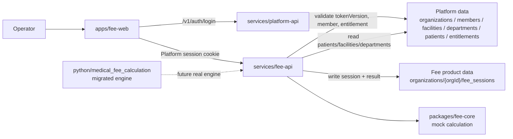

# P5 Fee Migration Runbook

Status: local implementation complete
Date: 2026-05-28
Cost profile: local only, no new GCP resources

## Scope

P5 moves the fee calculation product boundary into the new Halunasu monorepo without deploying paid infrastructure.

Implemented:

- `apps/fee-web`
- `services/fee-api`
- `packages/fee-contracts`
- `packages/fee-core`
- `python/medical_fee_calculation`
- `organizations/{orgId}/fee_sessions/{feeSessionId}` product storage path

Deferred:

- Cloud Run deploy for `fee-api`
- OpenAI extraction
- Cloud Tasks or async workers
- GCS artifacts
- real receipt export storage
- old staging project shutdown

## Architecture



## Data Boundary

Fee sessions use Platform IDs as the primary boundary:

```text
organizations/{orgId}/fee_sessions/{feeSessionId}
```

Each session stores:

- `orgId`
- `patientId`
- `patientRef` as the legacy/source-system alias
- `patientSnapshot`
- `facilityId`
- `facilitySnapshot.medicalInstitutionCode`
- `facilitySnapshot.regionalBureau`
- `departmentId`
- `departmentSnapshot`
- `claimMonth`
- `serviceDate`
- `orders`
- `calculationResult`

The old `tenant_id` and `OPERATOR_ACCOUNTS_JSON` paths are not part of the new production path.

## Local Verification

```bash
npm run test --workspace @halunasu/fee-contracts
npm run test --workspace @halunasu/fee-core
npm run test --workspace @halunasu/fee-api
npm run test --workspace @halunasu/fee-web
PYTHONDONTWRITEBYTECODE=1 python3 -m pytest python/tests
PYTHONDONTWRITEBYTECODE=1 PYTHONPATH=python python3 python/tests/test_medical_fee_calculation_import.py
```

Full JavaScript workspace check:

```bash
npm run test
```

## Manual Local Smoke

Start APIs in separate terminals:

```bash
npm run start:platform-api
npm run start:fee-api
```

Use `platform-api` to create or seed an organization, member, fee entitlement, facility, department, and patient. Then configure `apps/fee-web/index.html` meta tags for local API bases and open the file through a static server.

Expected smoke result:

- Platform login succeeds.
- `fee-web` lists patients, facilities, departments, and fee sessions.
- New patient creation writes to Platform patients.
- New fee session writes under the signed session `orgId`.
- The session contains `patientId`, `patientSnapshot`, `facilitySnapshot.medicalInstitutionCode`, and `facilitySnapshot.regionalBureau`.
- `mock-calculate` returns `provider: "mock"` and writes the result on the fee session.

## Cost Guardrails

Do not do the following in P5:

- deploy `fee-api` to Cloud Run
- set Cloud Run min instances above zero
- create Cloud Tasks queues
- create GCS buckets for fee artifacts
- add OpenAI keys to `medical-core-stg`
- add Cloud SQL, BigQuery, NAT, VMs, or GKE

If a staging deploy is needed later, mirror the P2/P3/P4 pattern: Cloud Run `min-instances=0`, staging `max-instances=1`, memory or Firestore only, and no LLM secrets until a single controlled smoke requires them.
