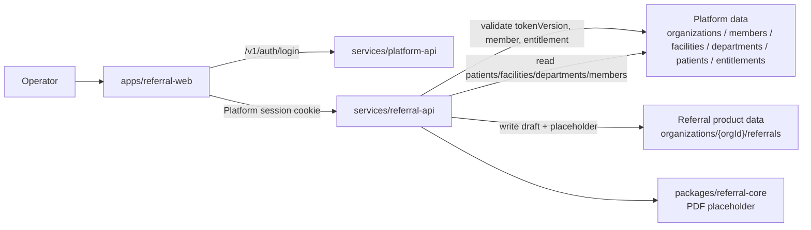

# P6 Referral Foundation Runbook

Status: local implementation complete
Date: 2026-05-28
Cost profile: local only, no new GCP resources

## Scope

P6 creates the referral letter product directly on the new Platform architecture.

Implemented:

- `apps/referral-web`
- `services/referral-api`
- `packages/referral-contracts`
- `packages/referral-core`
- `organizations/{orgId}/referrals/{referralId}` product storage path
- inline PDF placeholder creation

Deferred:

- Cloud Run deploy for `referral-api`
- real PDF rendering
- Cloud Storage for PDF/attachments
- LLM-assisted drafting
- explicit charting-to-referral import workflow

## Architecture



## Data Boundary

Referral drafts use Platform IDs as the primary boundary:

```text
organizations/{orgId}/referrals/{referralId}
```

Each draft stores:

- `orgId`
- `patientId`
- `patientSnapshot`
- `facilityId`
- `facilitySnapshot`
- `departmentId`
- `departmentSnapshot`
- `authorMemberId`
- `authorMemberSnapshot`
- `recipientInstitutionSnapshot`
- `recipientDoctorSnapshot`
- product-owned draft text
- optional `pdfPlaceholder`

The referral product does not read charting or fee product records directly in P6.

## Local Verification

```bash
npm run test --workspace @halunasu/referral-contracts
npm run test --workspace @halunasu/referral-core
npm run test --workspace @halunasu/referral-api
npm run test --workspace @halunasu/referral-web
npm run test
npm run build
```

## Manual Local Smoke

Start APIs in separate terminals:

```bash
npm run start:platform-api
npm run start:referral-api
```

Use `platform-api` to create or seed an organization, member, referral entitlement, facility, department, and patient. Then configure `apps/referral-web/index.html` meta tags for local API bases and open the file through a static server.

Expected smoke result:

- Platform login succeeds.
- `referral-web` lists patients, facilities, departments, and referrals.
- New patient creation writes to Platform patients.
- New referral draft writes under the signed session `orgId`.
- The draft contains patient, facility, department, author member, recipient institution, and recipient doctor snapshots.
- `pdf-placeholder` stores an inline placeholder on the referral draft.

## Cost Guardrails

Do not do the following in P6:

- deploy `referral-api` to Cloud Run
- set Cloud Run min instances above zero
- create Cloud Storage buckets for PDFs or attachments
- add external PDF rendering services
- add LLM secrets
- add Cloud SQL, BigQuery, NAT, VMs, or GKE

If a staging deploy is needed later, mirror the previous pattern: Cloud Run `min-instances=0`, staging `max-instances=1`, Firestore only, and no external rendering or LLM secrets until a controlled smoke requires them.
