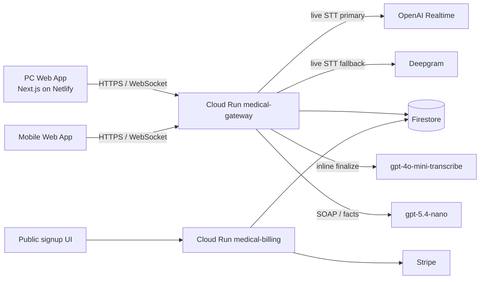
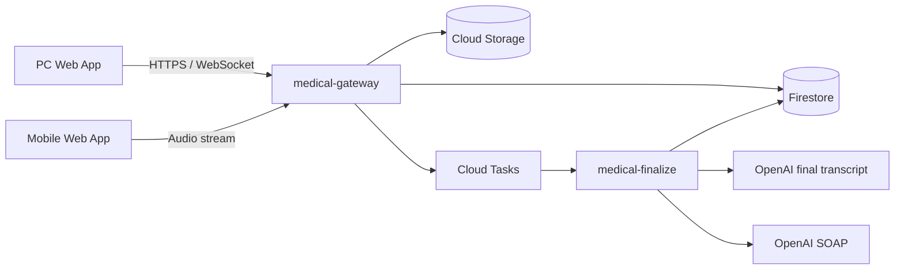

# System Architecture

## 概要

現在の `ハルナス` は、低遅延の live path と、品質重視の finalize path を分離した構成を取る。

- live path: WebSocket + provider streaming
- finalize path: stop 後の transcript 再処理と SOAP 生成

この分離自体は target architecture と同じだが、現時点の既定実装は `inline finalization` であり、非同期 worker は optional path として存在する。

## 現在の実装構成

## 目標構成

## コンポーネント

| コンポーネント | 現在の責務 |
|---|---|
| `apps/web` | ダッシュボード、診療 UI、設定 UI、公開申込 UI、モバイル参加 UI |
| `services/gateway` | operator auth、session 制御、WebSocket、録音、STT、SOAP 生成、監査 |
| `services/billing` | contact signup、メール確認、初回設定、Stripe webhook、billing status API |
| `services/finalize` | 非同期 finalize worker。現時点では optional path |
| `packages/core` | store、auth、STT adapters、SOAP / billing domain logic |
| Firestore | durable state、turns、SOAP versions、監査、organization / member / signup |
| Cloud Storage | `FINALIZE_MODE != inline` 時の raw audio と派生 artifact |

## live path

### セッション作成から録音開始まで

1. PC が gateway で session を作成する。
2. gateway が pairing token と短縮コードを発行する。
3. スマホが `/api/v1/pairings/{pairingId}/claim` で参加する。
4. スマホは stream token を受け取り、`/ws` に `role=mobile` で接続する。
5. PC は operator session で `role=pc` として `/ws` に接続する。

### 録音中

- audio frame は WebSocket binary frame で gateway に送る
- gateway は OpenAI Realtime を primary に使う
- provider error 時は Deepgram へ failover する
- partial / final transcript は gateway から PC へ push される
- final turn は Firestore に保存する

## finalize path

### 現在の既定: inline

- `FINALIZE_MODE=inline`
- gateway が stop 後に `finalizeSession()` を直接呼ぶ
- live transcript と precompute transcript を見ながら final transcript を選択する
- raw audio は gateway メモリ上に保持し、必要なら final retranscription に使う
- SOAP 生成中は `soap.stream.updated` を段階的に publish する

### optional async path

- `FINALIZE_MODE != inline`
- gateway は raw audio を GCS に保存し、`rawAudioPath` を session に書く
- Cloud Tasks があれば enqueue、なければ `FINALIZE_ENDPOINT` に直接 POST する
- `services/finalize` が transcript / SOAP を生成し、Firestore に結果を書き戻す

## 状態同期

### hot path

- live events は WebSocket で配信する
- browser は Firestore realtime subscription を使わない

### durable path

- session / turns / latestSoap は HTTP fetch で再読込できる
- reconnect 後は `GET /api/v1/sessions/:sessionId` と WebSocket 再接続で復元する

## 実装上の制約

### 1. WebSocket fanout は instance-local

- `services/gateway` は process memory に socket index を持つ
- そのため phase 1 は `max-instances=1` を前提にする

### 2. raw audio の durability は mode 依存

- `inline` では finalization まで gateway memory に保持する
- `async` では GCS に保存して worker に渡す

### 3. PC からの録音も WebSocket 経由

- `role=recorder` が存在し、local browser mic も live pipeline に載る

## 認証モデル

### PC / 設定画面

- login は `organizationCode + loginId + password`
- browser は HttpOnly session cookie を基本に使う
- state-changing API は CSRF token を要求する
- 特権ロールには MFA を適用できる

### モバイル

- 永続ログインは持たない
- pairing token で参加し、stream token を受け取る
- stream token は `sessionId`, `deviceId`, `pairingId`, `orgId` に束縛される

## データ保護

- transcript や SOAP の durable state は Firestore に保存する
- raw audio の GCS 保存は async path で使用する
- application log には PHI を直接出さず、safe payload を監査ログに残す
- retention cleanup は専用 script で運用できる

## まとめ

現在の source of truth は次のとおり。

- live path: `medical-gateway` が中心
- finalize path: 既定は inline、target は async worker
- billing / onboarding: `medical-billing`
- browser state sync: HTTP + WebSocket
- horizontal scale: まだ gateway 1 instance 前提
