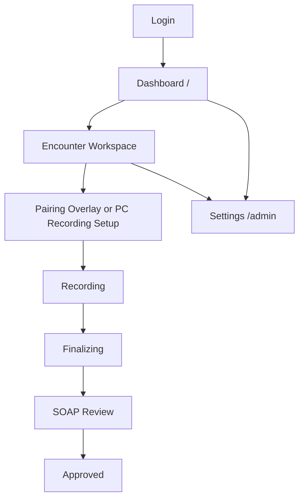

# Screen Flows

## 現在の画面群

- PC ダッシュボード: `/`
- セッション一覧 alias: `/sessions`
- 診療ワークスペース: `/sessions/[sessionId]`
- 設定 / 管理: `/admin`
- 公開申込: `/contact-signup`
- 初回設定: `/setup-password/[tokenId]`
- モバイル参加: `/mobile/join`, `/mobile/recorder`

## 認証済み PC フロー



## 公開導入フロー

```mermaid
flowchart TD
    A[/contact-signup] --> B[/contact-signup/submitted]
    B --> C[/contact-signup/verify]
    C --> D[/setup-password/:tokenId]
    D --> E[Login]
    E --> F[/]
```

## モバイル参加フロー

```mermaid
flowchart TD
    A[QR or link open] --> B[/mobile/join or /mobile/recorder]
    B --> C[Pairing Claim]
    C --> D[Mic Permission]
    D --> E[Mic Ready]
    E --> F[Recording]
    F --> G[Stopped / Completed]
    D --> H[Permission Error]
```

## PC 画面仕様

### 1. Login

目的:

- 医療機関コード、個人 ID、パスワードでログインする
- 必要なら MFA verify / enroll に進む

### 2. Dashboard `/`

目的:

- 新規診療の開始
- 直近セッションの確認
- 状態フィルタと検索
- 設定画面への導線

主要 UI:

- `新しい診療を開始`
- セッション履歴
- 検索ボックス
- 状態フィルタ
- 右上メニュー
- 契約状態 banner

現在の実装メモ:

- 患者情報はここで入力するのではなく、作成後にワークスペースで編集する
- `/sessions` は実装 alias で、日常導線は `/`

### 3. Encounter Workspace `/sessions/[sessionId]`

目的:

- 録音、書き起こし、SOAP の一連の操作を行う

レイアウト:

- 左: transcript
- 中央: 状態カード、ハイライト、接続状態
- 右: SOAP / review

主要 UI:

- QR / 接続 overlay
- 録音方法の選択
- patient info 編集
- prompt profile 選択
- transcript mode badge
- SOAP copy / save / approve

### 4. Pairing Overlay

目的:

- 録音スマホを接続する

主要 UI:

- QR 表示
- 接続リンクコピー
- pairing 再発行

補足:

- UI は QR / 接続リンク中心
- `pairingCode` は backend 上は存在するが、現行 UI の主経路では目立たせていない

### 5. Recording Choice

目的:

- 録音元を選ぶ

選択肢:

- `iPhoneで録音`
- `このPCで録音`

### 6. Recording

目的:

- live transcript を見ながら診療を進める

表示内容:

- transcript partial / final
- mic ready / connected / degraded status
- elapsed timer
- audio activity
- quick action footer

### 7. Finalizing

目的:

- final transcript と SOAP 作成中であることを示す

表示内容:

- `処理中`
- transcript freeze
- SOAP preview stream
- retryable error 表示

### 8. SOAP Review

目的:

- AI 出力を review して EMR-ready text に仕上げる

主要 UI:

- outputText
- transcript reference
- `診療記録全文をコピー`
- `保存`
- `承認`
- `SOAPを更新`

## Settings `/admin`

設定トップは全ログイン済みメンバーに見えるが、各 section は role-gated である。

現在の section:

- `権限管理`
- `プロンプト設定`
- `音声テスト`
- `操作ログ`
- `アカウント`

補足:

- `/billing` は独立画面ではなく `アカウント` section へ誘導する
- account section から billing status と Checkout / Portal に進む

## 公開画面

### `/contact-signup`

- 医療機関名、担当者名、メール、電話番号、想定利用人数を受け付ける
- 利用規約 / プライバシーポリシー同意が必須

### `/contact-signup/verify`

- メール確認リンクから provisioning を明示的に実行する
- organization code / login ID / 送付先メールを表示する

### `/setup-password/[tokenId]`

- 管理者が初回パスワードを設定する

## モバイル画面

### `/mobile/join` と `/mobile/recorder`

現在はどちらも同じ `MobileJoinClient` を使う。

主要 UI:

- pairing claim
- QR scanner
- manual link paste fallback
- mic permission guidance
- level meter
- recording / stopped state

### `/mobile/audio-test`

- 音声テスト専用 UI

## 既知の future

- short code 単独入力中心の UI はまだ主導線ではない
- EMR export 専用画面はまだない
