# 問い合わせ起点 trial 利用・後決済 実装設計

最終更新: 2026-04-27
対象システム: `medical` / `medical-lp`
Stripe API version: `2026-03-25.dahlia`

## 1. 目的

本設計は、病院に最初に問い合わせフォームを入力してもらい、一定期間は無料で利用開始し、その後に Stripe 決済を行わないと継続利用できないフローを定義する。

目標は次の 5 点。

1. 問い合わせ送信から利用開始までを自動化する
2. trial 期間中に利用価値を体験してもらう
3. trial 終了後は決済しないと clinical use できない状態へ移行する
4. 管理者への案内はメール中心で運用できるようにする
5. billing / access 制御は backend 側で一貫して扱う

## 2. 推奨方針

### 2.1 採用する方針

- 問い合わせフォーム送信後に `signup_application` を作成する
- 送信直後に org/admin を作るのではなく、**メール確認完了後に provisioning** する
- trial 期間は `7日` を標準とする
- trial 中は通常利用可とする
- trial 終了後は Stripe Checkout Session を使って決済させる
- 支払い導線は static Payment Link ではなく、**認証済み admin が押した時に動的に Checkout Session を生成**する
- パスワードはメール送信せず、**初回パスワード設定リンク**だけ送る
- trial 失効後は `org_admin` のみ billing 操作のためにログイン可とし、clinical use は停止する

### 2.2 採用しない方針

- 問い合わせ送信だけで即 org を作る
- 平文パスワードをメール送信する
- Stripe の固定 Payment Link をそのまま org 識別なしで使う
- trial 失効後に完全ログイン不可にする
- billing 状態を frontend だけで判定する

### 2.3 推奨理由

この方式なら、trial 開始までは friction を下げつつ、メール確認と access 制御で最低限の安全性を確保できる。
また、決済時は動的 Checkout Session に `orgId` / `signupId` を metadata として入れられるため、誰が支払ったかを backend で確実に結び付けられる。
Stripe の recurring billing は Checkout Session + Subscription + webhook を基準に設計すべきであり、static Payment Link だけで課金状態を扱うのは弱い。

## 3. 全体フロー

```mermaid
flowchart LR
    LP[お問い合わせフォーム] --> FORM[signup_application 作成]
    FORM --> VERIFY_MAIL[メール確認リンク送信]
    VERIFY_MAIL --> VERIFIED[メール確認完了]
    VERIFIED --> PROV[org / admin 自動作成]
    PROV --> SETUP_MAIL[初回パスワード設定リンク送信]
    SETUP_MAIL --> SETUP[パスワード設定]
    SETUP --> TRIAL[trial 利用開始]
    TRIAL --> BANNER[アプリ内決済導線表示]
    BANNER --> CHECKOUT[Checkout Session 作成]
    CHECKOUT --> STRIPE[Stripe Checkout]
    STRIPE -->|checkout.session.completed| WEBHOOK[Stripe webhook]
    WEBHOOK --> ACTIVE[access.active]
    TRIAL -->|7日経過/未決済| LOCK[billing_action_required / suspended]
    LOCK --> CHECKOUT
```



## 4. 画面設計

## 4.1 `medical-lp` お問い合わせフォーム

配置先:
- `medical-lp` の CTA 導線
- または `medical/apps/web/app/signup` を問い合わせ起点 UI に置き換える

入力項目:
- 医療機関名
- 担当者名
- メールアドレス
- 電話番号
- 想定利用人数
- 備考

表示要件:
- 送信ボタン
- 送信中 loading
- 送信完了メッセージ
- `確認メールを送信しました` 表示

必須の安全策:
- Turnstile または reCAPTCHA
- rate limit

## 4.2 メール確認完了画面

役割:
- メール確認リンク踏破後の完了画面
- `病院アカウントを準備中です` を表示

表示要件:
- 処理中 loading
- 完了後に `初回パスワード設定メールを送信しました`

## 4.3 初回パスワード設定画面

既存の `setup-password/[tokenId]` を再利用する。

表示要件:
- 新しいパスワード入力
- 確認入力
- 送信ボタン
- 完了後にログイン画面へ遷移

## 4.4 trial 中のアプリ内導線

場所:
- 全ページ共通 banner
- `アカウント` 画面

表示内容:
- `無料利用期間はあと X 日`
- `継続利用には決済が必要です`
- `決済する`

注意:
- 既存の `契約と請求` 専用ページは必須ではない
- 現在の UI 方針に合わせ、`アカウント` 画面へ統合するのが自然

## 4.5 trial 失効後

表示場所:
- ログイン後直後の blocking banner / card
- `アカウント` 画面

表示内容:
- `無料利用期間が終了しました`
- `継続利用には決済が必要です`
- `決済する`

挙動:
- `org_admin`: ログイン可、billing 操作可、clinical use 不可
- 一般ユーザー: ログイン不可、または read-only なしで拒否

## 5. Firestore schema

## 5.1 `signup_applications/{signupId}`

```json
{
  "status": "submitted",
  "source": "lp_contact_form",
  "organizationName": "医療法人サンプルクリニック",
  "organizationCode": "sample-clinic",
  "adminName": "山田 太郎",
  "adminEmail": "admin@example.jp",
  "adminLoginId": "admin",
  "phoneNumber": "03-0000-0000",
  "seatEstimate": 5,
  "notes": "trial 希望",
  "emailVerifiedAt": null,
  "verificationTokenHash": "sha256:...",
  "provisionedOrgId": null,
  "provisionedMemberId": null,
  "trialDays": 7,
  "createdAt": "2026-04-27T00:00:00.000Z",
  "updatedAt": "2026-04-27T00:00:00.000Z",
  "expiresAt": "2026-05-04T00:00:00.000Z"
}
```

状態:
- `submitted`
- `verified`
- `provisioning`
- `provisioned`
- `expired`
- `closed`

## 5.2 `email_verification_tokens/{tokenId}`

```json
{
  "signupId": "sa_xxx",
  "tokenHash": "sha256:...",
  "email": "admin@example.jp",
  "expiresAt": "2026-04-28T00:00:00.000Z",
  "consumedAt": null,
  "createdAt": "2026-04-27T00:00:00.000Z"
}
```

目的:
- メール確認リンクの one-time token 管理

## 5.3 `password_setup_tokens/{tokenId}`

既存 collection を再利用する。追加で必要なら以下を持つ。

```json
{
  "orgId": "org_xxx",
  "memberId": "mem_xxx",
  "email": "admin@example.jp",
  "expiresAt": "2026-04-28T00:00:00.000Z",
  "consumedAt": null,
  "createdAt": "2026-04-27T00:00:00.000Z"
}
```

## 5.4 `organizations/{orgId}.billing`

```json
{
  "provider": "stripe",
  "planCode": "medical_ai_monthly",
  "status": "trialing",
  "trialEndsAt": "2026-05-04T00:00:00.000Z",
  "currentPeriodEnd": null,
  "gracePeriodEndsAt": null,
  "stripeCustomerId": null,
  "stripeSubscriptionId": null,
  "stripePriceId": null,
  "cancelAtPeriodEnd": false,
  "seatQuantity": 1,
  "lastStripeEventId": null,
  "updatedAt": "2026-04-27T00:00:00.000Z"
}
```

状態:
- `trialing`
- `checkout_pending`
- `active`
- `past_due`
- `grace_period`
- `suspended`
- `canceled`

## 5.5 `organizations/{orgId}.access`

```json
{
  "status": "active",
  "reason": "billing.trial_active",
  "updatedAt": "2026-04-27T00:00:00.000Z"
}
```

状態:
- `pending_setup`
- `active`
- `billing_action_required`
- `suspended`
- `canceled`

## 5.6 `stripe_event_receipts/{eventId}`

既存設計を再利用する。

役割:
- webhook 冪等化
- event payload 保存
- 処理状態管理

## 6. API 設計

## 6.1 public API

### `POST /api/v1/contact-signups`

役割:
- 問い合わせフォーム送信

request:
```json
{
  "organizationName": "医療法人サンプルクリニック",
  "adminName": "山田 太郎",
  "adminEmail": "admin@example.jp",
  "phoneNumber": "03-0000-0000",
  "seatEstimate": 5,
  "notes": "trial 希望",
  "captchaToken": "..."
}
```

response:
```json
{
  "signupId": "sa_xxx",
  "status": "submitted"
}
```

処理:
- input validation
- rate limit
- captcha verify
- `signup_application` 作成
- メール確認リンク送信

### `GET /api/v1/contact-signups/verify`

query:
- `token`

役割:
- メール確認 token 消費
- provisioning を起動

response:
- HTML redirect または success JSON

### `GET /api/v1/contact-signups/:signupId/status`

役割:
- provisioning 状態確認

response:
```json
{
  "status": "provisioned",
  "setupRequired": true
}
```

## 6.2 authenticated API

### `GET /api/v1/billing/status`

既存 API を再利用。
trial 中 / 決済必須状態 / active を返す。

### `POST /api/v1/billing/checkout-session`

役割:
- 認証済み `org_admin` が決済ボタンを押した時に Checkout Session を作成

request:
```json
{
  "successPath": "/admin?section=account",
  "cancelPath": "/admin?section=account"
}
```

response:
```json
{
  "checkoutUrl": "https://checkout.stripe.com/..."
}
```

Stripe metadata:
- `orgId`
- `signupId`
- `planCode`

### `POST /api/v1/billing/portal-session`

既存 API を再利用。
active / past_due / grace_period 中の管理者が Customer Portal を開く。

## 6.3 internal API

### `POST /internal/billing/process-stripe-event`

役割:
- webhook 後続処理

### `POST /internal/billing/enforce-trial-expiration`

役割:
- trial 終了後、未決済 org を `billing_action_required` または `suspended` に落とす

### `POST /internal/billing/reconcile-subscription`

役割:
- Stripe と Firestore の再同期

## 7. Stripe webhook 設計

必須イベント:
- `checkout.session.completed`
- `customer.subscription.created`
- `customer.subscription.updated`
- `customer.subscription.deleted`
- `invoice.paid`
- `invoice.payment_failed`

## 7.1 `checkout.session.completed`

用途:
- trial 後の初回決済成功
- checkout 完了時に `stripeCustomerId`, `stripeSubscriptionId`, `stripePriceId` を確定

処理:
1. `event.id` 冪等化確認
2. `metadata.orgId` 取得
3. org billing 更新
4. `billing.status = active`
5. `access.status = active`

## 7.2 `customer.subscription.updated`

用途:
- `trialing -> active`
- `active -> past_due`
- `cancel_at_period_end`

処理:
- status mapping
- currentPeriodEnd 更新
- gracePeriodEndsAt 設定

## 7.3 `invoice.payment_failed`

用途:
- 決済失敗

処理:
- `billing.status = past_due`
- `access.status = billing_action_required`
- `reason = billing.payment_failed`

## 7.4 `invoice.paid`

用途:
- 決済成功 / 復帰

処理:
- `billing.status = active`
- `access.status = active`

## 8. state machine

## 8.1 signup_application

```text
submitted
  -> verified
  -> provisioning
  -> provisioned
  -> closed
```

## 8.2 billing / access

```text
trialing + active
  -> checkout_pending + active
  -> active + active
  -> past_due + billing_action_required
  -> grace_period + billing_action_required
  -> suspended + suspended
```

## 9. GCP / バックグラウンド処理

必要要素:
- `services/billing`
- Secret Manager
  - `STRIPE_SECRET_KEY`
  - `STRIPE_WEBHOOK_SECRET`
  - `BILLING_INTERNAL_SECRET`
- Cloud Scheduler
  - `enforce-trial-expiration`
  - `enforce-grace-periods`
- Cloud Tasks
  - webhook 後続処理
  - provisioning

trial 失効 job:
- 毎時実行
- `trialEndsAt <= now`
- `billing.status == trialing`
- `stripeSubscriptionId == null`
または
- `billing.status == checkout_pending`
を対象に状態遷移

## 10. 懸念点

### 10.1 問い合わせだけで trial 開始すると悪用されやすい

懸念:
- bot 送信
- 捨てメアド登録
- 架空病院作成

対策:
- captcha
- rate limit
- メール確認必須
- 必要なら trial 開始数の制限

### 10.2 平文パスワード送信は不可

懸念:
- メール漏えい時の事故

対策:
- password setup token
- token 失効
- one-time consume

### 10.3 static Payment Link は追跡が弱い

懸念:
- 支払いと org の紐付けが曖昧
- webhook で誰の支払いか判定しづらい

対策:
- dynamic Checkout Session
- metadata に `orgId`, `signupId`

### 10.4 trial 失効後の完全ロックは危険

懸念:
- 支払い画面にも到達できなくなる

対策:
- `org_admin` は billing 操作用にログイン可
- clinical action だけ止める

### 10.5 未払い org のデータ保持ポリシー

懸念:
- trial だけ使って放置される org が溜まる

要決定:
- 30 / 60 / 90 日で削除
- 事前通知有無

## 11. 疑問点

実装前に決めるべき事項。

1. trial は `7日` 固定でよいか
2. `org_admin` 以外にも billing 操作を許すか
3. trial 失効後は一般ユーザーを完全ログイン不可にするか
4. 未払い org データを何日保持するか
5. 問い合わせフォームは `medical-lp` に置くか、`medical` に置くか
6. `organizationCode` / `adminLoginId` は自動採番か、問い合わせ時入力か
7. 送信直後に org 作成したい要望をどこまで残すか

## 12. 推奨

最終推奨は次。

1. 問い合わせフォーム送信
2. Firestore に `signup_application` 作成
3. メール確認
4. org/admin 自動作成
5. 初回パスワード設定リンク送信
6. 7日 trial 開始
7. アプリ内 banner + `アカウント` 画面から決済
8. trial 失効後は `billing_action_required`
9. Checkout 完了 webhook で `active` 復帰

この方式なら、
- 体験導線は軽い
- セキュリティ的に無理がない
- Stripe / Firestore / access 制御が整合する
- 現在の `services/billing` と `organization.billing/access` の既存基盤を再利用できる

## 13. 実装順

1. 問い合わせフォーム public API
2. `signup_application` / `email_verification_tokens` 追加
3. メール確認フロー
4. provisioning 起動
5. trial billing state 付与
6. `アカウント` 画面への billing CTA 統合
7. Checkout Session 動的生成
8. webhook 反映
9. trial expiration job
10. billing action required UI
